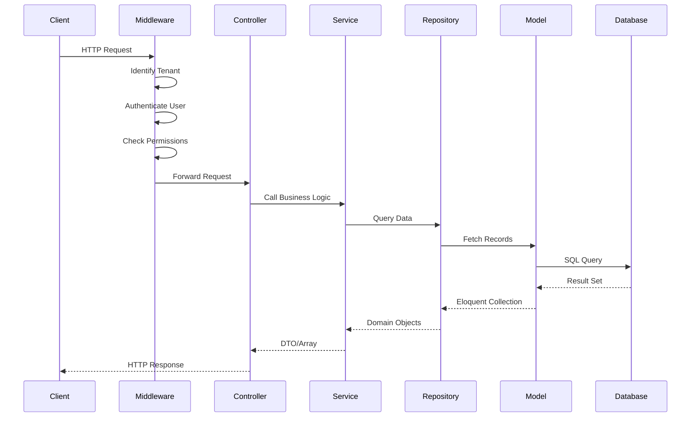
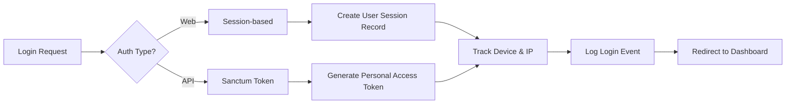

# Architecture

> **Technical architecture and design patterns for the multi-tenant SaaS platform**

## 🔗 Table of Contents

- [Overview](#overview)
- [Architectural Patterns](#architectural-patterns)
- [Layer Architecture](#layer-architecture)
- [Domain-Driven Design](#domain-driven-design)
- [Data Flow](#data-flow)
- [Deployment Architecture](#deployment-architecture)
- [Design Diagrams](#design-diagrams)
- [Best Practices](#best-practices)
- [Cross-Links](#cross-links)

## Overview

This Laravel 12 application follows a **layered, domain-driven architecture** with clear separation between business logic, application services, and infrastructure concerns.

### Architectural Goals

1. **Maintainability** - Easy to understand and modify
2. **Scalability** - Horizontal and vertical scaling support
3. **Testability** - Isolated, testable components
4. **Extensibility** - New features without breaking existing code
5. **Security** - Defense in depth, tenant isolation

## Architectural Patterns

### 1. Domain-Driven Design (DDD)

Business logic is organized into **bounded contexts** (domains):

```
app/Domains/
├── Access/        # RBAC, roles, permissions, menu management
├── Booking/       # Booking/appointment system
├── Dashboard/     # Dashboard widgets and layouts
├── Identity/      # Users, authentication, tenants
├── Notification/  # Multi-channel notifications
├── Provider/      # Service provider management
├── SSO/           # Single sign-on integration
├── Tenant/        # Tenant administration
└── Workflow/      # Workflow automation engine
```

Each domain contains:
- `Models/` - Eloquent models
- `Services/` - Business logic
- `Repositories/` - Data access layer
- `Http/Controllers/` - HTTP endpoints
- `Events/` - Domain events
- `Enums/` - Domain-specific enums

[Read More → Domain Modules](domain-modules.md)

### 2. Repository Pattern

Data access is abstracted through repositories:

```php
// Example: app/Domains/Access/Repositories/RoleRepository.php
class RoleRepository
{
    public function findByTenant(string $tenantId): Collection
    {
        return Role::where('tenant_id', $tenantId)->get();
    }
    
    public function findWithPermissions(string $roleId): Role
    {
        return Role::with('permissions')->findOrFail($roleId);
    }
}
```

**Benefits**:
- Testable (mock repositories in tests)
- Cacheable (add caching at repository level)
- Flexible (swap data sources without changing business logic)

### 3. Service Layer Pattern

Business operations are encapsulated in services:

```php
// Example: app/Services/DashboardService.php
class DashboardService
{
    public function getDashboardData(User $user): array
    {
        $role = $user->getHighestPriorityRole();
        
        return [
            'user' => [...],
            'stats' => $this->getStatsForUser($user),
            'widgets' => $this->getWidgetsForUser($user),
        ];
    }
}
```

**Benefits**:
- Reusable across controllers, commands, jobs
- Testable in isolation
- Clear transaction boundaries

### 4. Event-Driven Architecture

Domain events trigger side effects:

```php
// Event
class BookingConfirmed
{
    public function __construct(public Booking $booking) {}
}

// Listener
class SendBookingConfirmation
{
    public function handle(BookingConfirmed $event)
    {
        Notification::send(
            $event->booking->user,
            new BookingConfirmationEmail($event->booking)
        );
    }
}
```

**Benefits**:
- Decoupled components
- Async processing via queues
- Audit trail via event log

## Layer Architecture

### Presentation Layer
**Location**: `app/Http/Controllers/`, `resources/views/`

**Responsibilities**:
- HTTP request/response handling
- Input validation (via Form Requests)
- View rendering

**Example**:
```php
class UnifiedDashboardController extends Controller
{
    public function index(DashboardService $dashboardService)
    {
        $user = auth()->user();
        $data = $dashboardService->getDashboardData($user);
        
        return view('dashboard.index', $data);
    }
}
```

### Application Layer
**Location**: `app/Services/`, `app/Http/Middleware/`

**Responsibilities**:
- Orchestrate domain operations
- Cross-cutting concerns (logging, caching)
- Transaction management

**Example**:
```php
class SessionManager
{
    public function createSession(User $user, Request $request): UserSession
    {
        // Enforce session limits
        $this->enforceSessionLimit($user);
        
        // Create session record
        return UserSession::create([...]);
    }
}
```

### Domain Layer
**Location**: `app/Domains/*/`

**Responsibilities**:
- Core business logic
- Domain models and relationships
- Business rule enforcement

**Example**:
```php
class Booking extends Model
{
    public function confirm(): void
    {
        if ($this->status !== 'pending') {
            throw new InvalidBookingStateException();
        }
        
        $this->update(['status' => 'confirmed']);
        event(new BookingConfirmed($this));
    }
}
```

### Infrastructure Layer
**Location**: `app/Providers/`, `config/`, `database/`

**Responsibilities**:
- Database connections
- External service integrations
- Framework configuration

## Domain-Driven Design

### Bounded Contexts

Each domain is a **bounded context** with its own ubiquitous language:

| Domain | Language Examples |
|--------|------------------|
| **Booking** | Appointment, Service, Provider, Slot, Confirmation |
| **Workflow** | Definition, Step, Approval, Execution, Form |
| **Access** | Role, Permission, Policy, Resource, Action |
| **Identity** | User, Tenant, Session, MFA, Profile |

### Aggregates

Key aggregates and their boundaries:

**Tenant Aggregate**
```
Tenant (root)
├── TenantDomain
├── TenantConfig
└── TenantModule
```

**User Aggregate**
```
User (root)
├── UserProfile
├── UserSession
├── MfaMethod
└── Roles (many-to-many)
```

**Booking Aggregate**
```
Booking (root)
├── BookingStatusHistory
└── Service (reference)
```

### Domain Events

Events represent facts that happened:

- `UserRegistered`
- `BookingCreated`, `BookingConfirmed`, `BookingCancelled`
- `WorkflowStepCompleted`
- `RoleAssigned`
- `TenantSuspended`

[See Events →](events-and-listeners.md)

## Data Flow

### Request Lifecycle



### Tenant Context Flow

```mermaid
graph TD
    A[HTTP Request] --> B{Tenant Identification Middleware}
    B -->|Domain-based| C[Lookup in tenant_domains table]
    B -->|Header-based| D[Read X-Tenant-ID header]
    B -->|Subdomain| E[Parse subdomain from host]
    
    C --> F[Set app('tenant.id')]
    D --> F
    E --> F
    
    F --> G[Global Scope Applied]
    G --> H[All queries scoped to tenant]
```

### Authentication Flow



## Deployment Architecture

### Single-Server Deployment (Small Scale)

```
┌─────────────────────────────────────────┐
│           Load Balancer / Nginx         │
└─────────────────────────────────────────┘
                    │
┌─────────────────────────────────────────┐
│         Laravel Application             │
│  ┌─────────────────────────────────┐   │
│  │  Nginx + PHP-FPM (Laravel)      │   │
│  └─────────────────────────────────┘   │
│  ┌─────────────────────────────────┐   │
│  │  SQLite / MySQL Database        │   │
│  └─────────────────────────────────┘   │
│  ┌─────────────────────────────────┐   │
│  │  Queue Worker (Database)        │   │
│  └─────────────────────────────────┘   │
└─────────────────────────────────────────┘
```

### Multi-Server Deployment (Production Scale)

```
                ┌──────────────┐
                │ Load Balancer│
                └──────┬───────┘
                       │
      ┌────────────────┼────────────────┐
      │                │                │
┌─────▼────┐     ┌─────▼────┐    ┌─────▼────┐
│  Web 1   │     │  Web 2   │    │  Web N   │
│ (Laravel)│     │ (Laravel)│    │ (Laravel)│
└──────────┘     └──────────┘    └──────────┘
      │                │                │
      └────────────────┼────────────────┘
                       │
      ┌────────────────┼────────────────┐
      │                │                │
┌─────▼──────┐  ┌──────▼─────┐  ┌──────▼─────┐
│  Database  │  │   Redis    │  │  Storage   │
│  (Primary) │  │(Cache/Queue│  │    (S3)    │
└────────────┘  └────────────┘  └────────────┘
      │
┌─────▼──────┐
│  Database  │
│ (Replica)  │
└────────────┘

┌──────────────────────┐
│  Queue Workers       │
│  (Multiple Processes)│
└──────────────────────┘
```

## Best Practices

### 1. Dependency Injection

Use constructor injection for dependencies:

```php
class BookingController extends Controller
{
    public function __construct(
        private BookingService $bookingService,
        private NotificationService $notificationService
    ) {}
}
```

### 2. Interface Segregation

Define contracts for swappable implementations:

```php
interface NotificationChannel
{
    public function send(User $user, string $message): void;
}

class EmailChannel implements NotificationChannel { ... }
class SmsChannel implements NotificationChannel { ... }
```

### 3. Single Responsibility

Each class has one reason to change:

```php
// ❌ Bad: God class
class UserManager
{
    public function register() { ... }
    public function login() { ... }
    public function sendEmail() { ... }
    public function calculateStats() { ... }
}

// ✅ Good: Focused classes
class UserRegistrationService { ... }
class AuthenticationService { ... }
class EmailService { ... }
class UserStatsService { ... }
```

### 4. Immutable DTOs

Use data transfer objects for stable contracts:

```php
readonly class BookingData
{
    public function __construct(
        public string $userId,
        public string $serviceId,
        public Carbon $scheduledAt,
    ) {}
}
```

### 5. Query Optimization

Always eager load relationships to avoid N+1:

```php
// ❌ Bad: N+1 queries
$users = User::all();
foreach ($users as $user) {
    echo $user->profile->name; // New query each iteration
}

// ✅ Good: Single optimized query
$users = User::with('profile')->get();
foreach ($users as $user) {
    echo $user->profile->name; // Already loaded
}
```

## Cross-Links

### Related Documentation
- [System Design Philosophy](system-design-philosophy.md) - Why these choices were made
- [Domain Modules](domain-modules.md) - Deep dive into each domain
- [Services & Support](services-and-support.md) - Service layer details
- [Database Schema](database-schema.md) - Data model architecture
- [Middleware](middleware.md) - HTTP middleware stack

### Implementation Details
- [RBAC](rbac.md) - Access control implementation
- [Tenancy](tenancy.md) - Multi-tenant architecture
- [API Reference](api-reference.md) - HTTP API design
