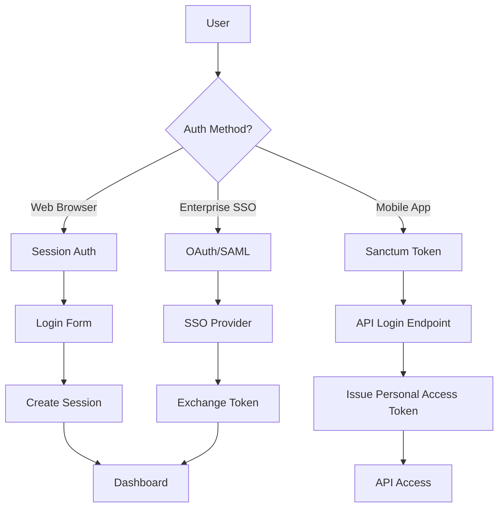
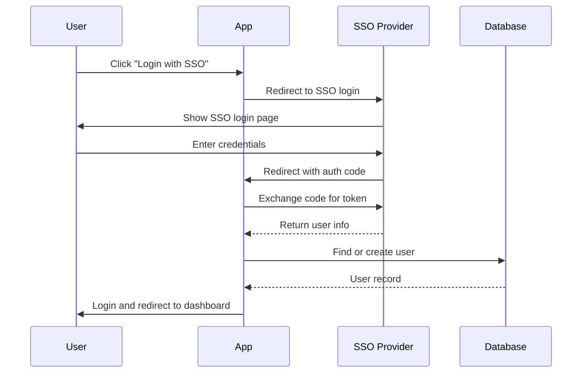

# Authentication

> **Multi-channel authentication system with Web, API, and SSO support**

## 🔗 Table of Contents

- [Overview](#overview)
- [Authentication Methods](#authentication-methods)
- [Web Authentication](#web-authentication)
- [API Authentication (Sanctum)](#api-authentication-sanctum)
- [SSO Integration](#sso-integration)
- [MFA Support](#mfa-support)
- [Session Management](#session-management)
- [Code Examples](#code-examples)
- [Security Considerations](#security-considerations)
- [Cross-Links](#cross-links)

## Overview

The platform supports **three authentication channels**:

1. **Web (Session-based)** - Traditional cookie-based auth for web UI
2. **API (Sanctum Tokens)** - Token-based auth for mobile apps and SPAs
3. **SSO (OAuth/SAML)** - Enterprise single sign-on integration

All channels share the same **User model** and **permission system**.

## Authentication Methods

### Supported Flows



## Web Authentication

### Routes

[`routes/web.php`](file:///C:/Users/Victo/Downloads/backends/Bk-upflame/routes/web.php#L35-L54):

```php
Route::middleware('guest')->group(function () {
    Route::get('/login', [LoginController::class, 'showLoginForm'])->name('login');
    Route::post('/login', [LoginController::class, 'login']);
    
    Route::get('/register', [RegisterController::class, 'showRegistrationForm']);
    Route::post('/register', [RegisterController::class, 'register']);
    
    Route::get('/forgot-password', [ForgotPasswordController::class, 'showLinkRequestForm']);
    Route::post('/forgot-password', [ForgotPasswordController::class, 'sendResetLinkEmail']);
});

Route::post('/logout', [LoginController::class, 'logout'])->middleware('auth');
```

### Login Flow

```php
// app/Http/Controllers/Auth/LoginController.php
public function login(Request $request)
{
    $credentials = $request->validate([
        'email' => 'required|email',
        'password' => 'required',
    ]);
    
    // Attempt authentication
    if (Auth::attempt($credentials, $request->boolean('remember'))) {
        $user = Auth::user();
        
        // Check if user is active
        if (!$user->isActive()) {
            Auth::logout();
            return back()->withErrors(['email' => 'Account is inactive']);
        }
        
        // Check if account is locked
        if ($user->isLocked()) {
            Auth::logout();
            return back()->withErrors(['email' => 'Account is locked']);
        }
        
        // Regenerate session (security)
        $request->session()->regenerate();
        
        // Create session record
        app(SessionManager::class)->createSession($user, $request);
        
        // Log login event
        event(new UserLoggedIn($user));
        
        // Update last login timestamp
        $user->update(['last_login' => now()]);
        
        return redirect()->intended('/dashboard');
    }
    
    // Failed login - increment failed attempts
    $this->incrementLoginAttempts($request);
    
    return back() ->withErrors(['email' => 'Invalid credentials']);
}
```

### Session Storage

Sessions are stored in the **database** for:
- ✅ Multi-server scalability
- ✅ Active session management
- ✅ Device tracking
- ✅ Session revocation

**Configuration:** [`config/session.php`](file:///C:/Users/Victo/Downloads/backends/Bk-upflame/config/session.php)

```php
return [
    'driver' => env('SESSION_DRIVER', 'database'),
    'lifetime' => env('SESSION_LIFETIME', 120), // minutes
    'expire_on_close' => false,
    'encrypt' => false,
    'table' => 'sessions',
    'lottery' => [2, 100], // Cleanup old sessions
];
```

### Logout Flow

```php
public function logout(Request $request)
{
    $user = Auth::user();
    
    // Log logout event
    event(new UserLoggedOut($user));
    
    // Terminate current session record
    app(SessionManager::class)->terminateSession(session()->getId());
    
    // Laravel session logout
    Auth::logout();
    
    // Invalidate session
    $request->session()->invalidate();
    
    // Regenerate CSRF token
    $request->session()->regenerateToken();
    
    return redirect('/login');
}
```

## API Authentication (Sanctum)

### Token-Based Flow

**Login endpoint:**  
[`routes/api.php`](file:///C:/Users/Victo/Downloads/backends/Bk-upflame/routes/api.php)

```php
// POST /api/v1/login
Route::post('/login', [ApiAuthController::class, 'login']);

// Protected routes
Route::middleware('auth:sanctum')->group(function () {
    Route::get('/user', fn() => auth()->user());
    Route::post('/logout', [ApiAuthController::class, 'logout']);
});
```

**Login implementation:**

```php
// app/Http/Controllers/Api/V1/AuthController.php
public function login(Request $request)
{
    $credentials = $request->validate([
        'email' => 'required|email',
        'password' => 'required',
        'device_name' => 'required|string',
    ]);
    
    $user = User::where('email', $credentials['email'])->first();
    
    if (!$user || !Hash::check($credentials['password'], $user->password)) {
        throw ValidationException::withMessages([
            'email' => ['The provided credentials are incorrect.'],
        ]);
    }
    
    // Check user status
    if (!$user->isActive()) {
        throw ValidationException::withMessages([
            'email' => ['Account is inactive.'],
        ]);
    }
    
    // Create token
    $token = $user->createToken($credentials['device_name'])->plainTextToken;
    
    return response()->json([
        'token' => $token,
        'user' => new UserResource($user),
        'expires_at' => now()->addDays(30),
    ]);
}
```

### Token Management

**Create token:**
```php
$token = $user->createToken('mobile-app')->plainTextToken;
```

**Revoke token:**
```php
// Revoke current token
$request->user()->currentAccessToken()->delete();

// Revoke all tokens
$user->tokens()->delete();

// Revoke specific token
$user->tokens()->where('id', $tokenId)->delete();
```

**Token abilities (scopes):**
```php
$token = $user->createToken('admin-token', ['create', 'update', 'delete']);

// Check ability in middleware
Route::middleware(['auth:sanctum', 'abilities:create,update'])->group(...);
```

### Sanctum Configuration

[`config/sanctum.php`](file:///C:/Users/Victo/Downloads/backends/Bk-upflame/config/sanctum.php):

```php
return [
    'expiration' => null, // No expiration (manual revocation only)
    
    'middleware' => [
        'verify_csrf_token' => App\Http\Middleware\VerifyCsrfToken::class,
        'encrypt_cookies' => App\Http\Middleware\EncryptCookies::class,
    ],
];
```

## SSO Integration

### Supported Providers

The platform supports SSO via:
- OAuth 2.0 (Google, Facebook, Azure AD)
- SAML 2.0 (Okta, OneLogin, ADFS)
- Custom identity providers

### SSO Flow



### SSO Routes

[`routes/web.php`](file:///C:/Users/Victo/Downloads/backends/Bk-upflame/routes/web.php#L65-L68):

```php
Route::middleware('auth')->prefix('sso')->name('sso.')->group(function () {
    Route::get('/token', [SsoController::class, 'token'])->name('token');
    Route::post('/revoke', [SsoController::class, 'revoke'])->name('revoke');
});
```

### SSO Configuration

**tenant_identity_providers table:**

| Column | Type | Description |
|--------|------|-------------|
| tenant_id | ULID | Tenant owning this SSO config |
| provider | enum | 'google', 'azure', 'okta', 'saml' |
| config_json | json | Provider-specific settings |
| is_enabled | boolean | Enable/disable SSO |

**Example config:**
```json
{
    "client_id": "abc123...",
    "client_secret": "xyz789...",
    "redirect_uri": "https://tenant.app.com/sso/callback",
    "scopes": ["openid", "profile", "email"]
}
```

## MFA Support

### Multi-Factor Authentication

The platform has infrastructure for MFA (not fully implemented):

**mfa_methods table:**

| Column | Type | Description |
|--------|------|-------------|
| user_id | ULID | User owning this MFA method |
| method_type | enum | 'totp', 'sms', 'email' |
| secret | string (encrypted) | TOTP secret or phone number |
| backup_codes | json (encrypted) | Recovery codes |
| verified_at | timestamp | When method was verified |

### Planned MFA Flow

1. User enables MFA in settings
2. Generate TOTP secret or send SMS code
3. User verifies by entering code
4. Save method to mfa_methods table
5. On login, require MFA code after password

**Future implementation:**
```php
// After password verification
if ($user->mfaEnabled) {
    session()->put('mfa_required_for', $user->id);
    return redirect()->route('mfa.verify');
}
```

## Session Management

### UserSession Model

[`app/Domains/Identity/Models/UserSession.php`](file:///C:/Users/Victo/Downloads/backends/Bk-upflame/app/Domains/Identity/Models/UserSession.php):

**Tracks:**
- Session ID
- Device ID (fingerprint)
- IP address
- User agent
- Last activity
- Expiration

### Session Manager Service

[`app/Services/SessionManager.php`](file:///C:/Users/Victo/Downloads/backends/Bk-upflame/app/Services/SessionManager.php):

```php
class SessionManager
{
    public function createSession(User $user, Request $request): UserSession
    {
        return UserSession::create([
            'user_id' => $user->id,
            'tenant_id' => $user->tenant_id,
            'session_id' => session()->getId(),
            'device_id' => $this->generateDeviceId($request),
            'ip_address' => $request->ip(),
            'user_agent' => $request->userAgent(),
            'last_activity' => now(),
            'expires_at' => now()->addMinutes(config('session.lifetime')),
        ]);
    }
    
    public function terminateAllSessions(User $user, ?string $exceptSessionId = null): int
    {
        return $user->terminateAllSessions($exceptSessionId);
    }
}
```

### Active Session Limit

Configured in [`config/dashboard.php`](file:///C:/Users/Victo/Downloads/backends/Bk-upflame/config/dashboard.php):

```php
'session_limit' => env('DASHBOARD_SESSION_LIMIT', 5),
```

**Enforcement:**
```php
public function enforceSessionLimit(User $user): void
{
    $limit = config('dashboard.session_limit');
    
    if ($limit > 0) {
        $sessions = $user->getActiveSessions();
        
        if ($sessions->count() >= $limit) {
            // Remove oldest session
            $oldest = $sessions->sortBy('last_activity')->first();
            $oldest->delete();
        }
    }
}
```

## Code Examples

### Custom Authentication Guard

```php
// config/auth.php
'guards' => [
    'web' => [
        'driver' => 'session',
        'provider' => 'users',
    ],
    'api' => [
        'driver' => 'sanctum',
        'provider' => 'users',
    ],
],
```

### Checking Authentication

```php
// In controller
if (!auth()->check()) {
    return redirect()->route('login');
}

// In Blade
@auth
    <p>Welcome, {{ auth()->user()->email }}</p>
@endauth

@guest
    <a href="{{ route('login') }}">Login</a>
@endguest
```

### Multi-Guard Authentication

```php
// Authenticate with specific guard
Auth::guard('api')->attempt($credentials);

// Get authenticated user from specific guard
$user = auth('api')->user();
```

## Security Considerations

### Password Hashing

Uses bcrypt with configurable cost:

```php
// config/hashing.php
'bcrypt' => [
    'rounds' => env('BCRYPT_ROUNDS', 12),
],
```

### CSRF Protection

All POST/PUT/DELETE routes automatically protected:

```blade
<form method="POST" action="/logout">
    @csrf  <!-- Required for CSRF protection -->
    <button type="submit">Logout</button>
</form>
```

### Rate Limiting

```php
// app/Http/Controllers/Auth/LoginController.php
use Illuminate\Support\Facades\RateLimiter;

protected function incrementLoginAttempts(Request $request)
{
    $key = 'login|' . $request->ip();
    RateLimiter::hit($key, 60 * 5); // 5 minute decay
    
    if (RateLimiter::tooManyAttempts($key, 5)) {
        $seconds = RateLimiter::availableIn($key);
        throw new TooManyRequestsException("Too many login attempts. Try again in {$seconds} seconds");
    }
}
```

### Account Lockout

After 5 failed attempts:

```php
$user->update([
    'failed_login_attempts' => $user->failed_login_attempts + 1,
]);

if ($user->failed_login_attempts >= 5) {
    $user->update([
        'locked_until' => now()->addMinutes(30),
    ]);
}
```

## Cross-Links

- [Security](security.md) - Comprehensive security features
- [Session Management](security.md#session-security) - Session lifecycle
- [RBAC](rbac.md) - Permission system after authentication
- [API Reference](api-reference.md) - API authentication endpoints
