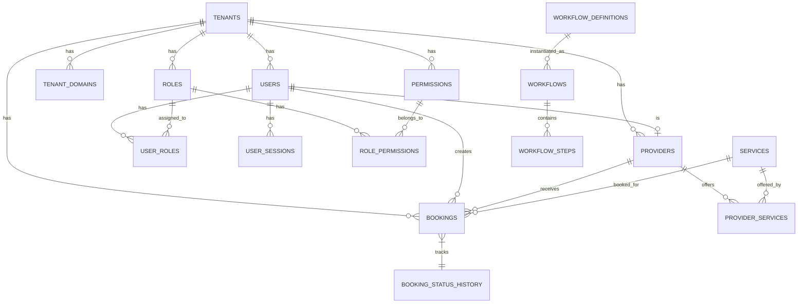

# Database Schema

> **Complete database structure with entity relationships and migrations**

## 🔗 Table of Contents

- [Overview](#overview)
- [Schema Design Principles](#schema-design-principles)
- [Core Tables](#core-tables)
- [Domain Tables](#domain-tables)
- [Entity Relationship Diagram](#entity-relationship-diagram)
- [Migrations](#migrations)
- [Indexes](#indexes)
- [Cross-Links](#cross-links)

## Overview

The platform uses **UUID (ULID)** for all primary keys, providing globally unique, time-sorted identifiers optimized for distributed systems.

### Database Statistics

- **Total Migrations**: 53
- **Total Tables**: ~45
- **Key Relationships**: 30+ foreign keys
- **Primary Key Type**: ULID (26 characters)
- **Supported Databases**: SQLite (dev), MySQL, PostgreSQL (prod)

## Schema Design Principles

### 1. ULID Primary Keys

```sql
CREATE TABLE users (
    id VARCHAR(26) PRIMARY KEY,  -- ULID, not auto-increment
    ...
);
```

**Benefits:**
- Globally unique across all tables
- Time-ordered (better for indexes)
- No collision risk when merging tenants
- URL-safe

### 2. Tenant Isolation

All tenant-scoped tables include:

```sql
tenant_id VARCHAR(26) NOT NULL,
FOREIGN KEY (tenant_id) REFERENCES tenants(id) ON DELETE CASCADE,
INDEX idx_tenant (tenant_id)
```

### 3. Soft Deletes

Critical tables use soft deletes:

```sql
deleted_at TIMESTAMP NULL
```

### 4. Timestamps

All tables have:

```sql
created_at TIMESTAMP NULL,
updated_at TIMESTAMP NULL
```

## Core Tables

### tenants

**Purpose**: Organization/tenant records

```sql
CREATE TABLE tenants (
    id VARCHAR(26) PRIMARY KEY,
    name VARCHAR(255) NOT NULL,
    slug VARCHAR(255) UNIQUE NOT NULL,
    domain VARCHAR(255) NULL,
    status ENUM('pending', 'active', 'suspended', 'deleted') DEFAULT 'pending',
    tier ENUM('free', 'basic', 'premium', 'enterprise') DEFAULT 'free',
    timezone VARCHAR(50) DEFAULT 'UTC',
    locale VARCHAR(10) DEFAULT 'en-US',
    parent_tenant_id VARCHAR(26) NULL,
    config_json JSON NULL,
    created_at TIMESTAMP NULL,
    updated_at TIMESTAMP NULL,
    
    INDEX idx_status (status),
    INDEX idx_tier (tier),
    FOREIGN KEY (parent_tenant_id) REFERENCES tenants(id)
);
```

### tenant_domains

**Purpose**: Multi-domain support for tenants

```sql
CREATE TABLE tenant_domains (
    id VARCHAR(26) PRIMARY KEY,
    tenant_id VARCHAR(26) NOT NULL,
    domain VARCHAR(255) NOT NULL UNIQUE,
    is_primary BOOLEAN DEFAULT false,
    verified BOOLEAN DEFAULT false,
    verification_token VARCHAR(100) NULL,
    created_at TIMESTAMP NULL,
    updated_at TIMESTAMP NULL,
    
    FOREIGN KEY (tenant_id) REFERENCES tenants(id) ON DELETE CASCADE,
    INDEX idx_tenant (tenant_id),
    INDEX idx_verified (verified)
);
```

### users

**Purpose**: User accounts (all roles)

```sql
CREATE TABLE users (
    id VARCHAR(26) PRIMARY KEY,
    tenant_id VARCHAR(26) NULL,
    email VARCHAR(255) NOT NULL,
    password VARCHAR(255) NOT NULL,
    status ENUM('active', 'inactive', 'suspended') DEFAULT 'active',
    primary_role_id VARCHAR(26) NULL,
    mfa_enabled BOOLEAN DEFAULT false,
    email_verified BOOLEAN DEFAULT false,
    phone_verified BOOLEAN DEFAULT false,
    last_login TIMESTAMP NULL,
    failed_login_attempts INT DEFAULT 0,
    locked_until TIMESTAMP NULL,
    remember_token VARCHAR(100) NULL,
    created_at TIMESTAMP NULL,
    updated_at TIMESTAMP NULL,
    
    UNIQUE KEY unique_tenant_email (tenant_id, email),
    FOREIGN KEY (tenant_id) REFERENCES tenants(id) ON DELETE CASCADE,
    INDEX idx_tenant (tenant_id),
    INDEX idx_status (status),
    INDEX idx_email (email)
);
```

### roles

**Purpose**: RBAC roles

```sql
CREATE TABLE roles (
    id VARCHAR(26) PRIMARY KEY,
    tenant_id VARCHAR(26) NULL,
    name VARCHAR(255) NOT NULL,
    description TEXT NULL,
    role_family VARCHAR(100) NULL,
    priority INT NOT NULL DEFAULT 100,
    is_system BOOLEAN DEFAULT false,
    created_at TIMESTAMP NULL,
    updated_at TIMESTAMP NULL,
    
    INDEX idx_tenant_priority (tenant_id, priority),
    INDEX idx_family (role_family),
    FOREIGN KEY (tenant_id) REFERENCES tenants(id) ON DELETE CASCADE
);
```

### permissions

**Purpose**: Granular permissions

```sql
CREATE TABLE permissions (
    id VARCHAR(26) PRIMARY KEY,
    tenant_id VARCHAR(26) NULL,
    name VARCHAR(255) NOT NULL,
    resource VARCHAR(100) NULL,
    action VARCHAR(100) NULL,
    description TEXT NULL,
    meta JSON NULL,
    created_at TIMESTAMP NULL,
    updated_at TIMESTAMP NULL,
    
    UNIQUE KEY unique_tenant_permission (tenant_id, name),
    FOREIGN KEY (tenant_id) REFERENCES tenants(id) ON DELETE CASCADE,
    INDEX idx_resource (resource)
);
```

### role_permissions (pivot)

```sql
CREATE TABLE role_permissions (
    role_id VARCHAR(26) NOT NULL,
    permission_id VARCHAR(26) NOT NULL,
    created_at TIMESTAMP NULL,
    updated_at TIMESTAMP NULL,
    
    PRIMARY KEY (role_id, permission_id),
    FOREIGN KEY (role_id) REFERENCES roles(id) ON DELETE CASCADE,
    FOREIGN KEY (permission_id) REFERENCES permissions(id) ON DELETE CASCADE
);
```

### user_roles (pivot)

```sql
CREATE TABLE user_roles (
    user_id VARCHAR(26) NOT NULL,
    role_id VARCHAR(26) NOT NULL,
    tenant_id VARCHAR(26) NOT NULL,
    assigned_by VARCHAR(26) NULL,
    created_at TIMESTAMP NULL,
    updated_at TIMESTAMP NULL,
    
    PRIMARY KEY (user_id, role_id, tenant_id),
    FOREIGN KEY (user_id) REFERENCES users(id) ON DELETE CASCADE,
    FOREIGN KEY (role_id) REFERENCES roles(id) ON DELETE CASCADE,
    FOREIGN KEY (tenant_id) REFERENCES tenants(id) ON DELETE CASCADE
);
```

## Domain Tables

### Booking Domain

#### bookings

```sql
CREATE TABLE bookings (
    id VARCHAR(26) PRIMARY KEY,
    tenant_id VARCHAR(26) NOT NULL,
    user_id VARCHAR(26) NOT NULL,
    provider_id VARCHAR(26) NOT NULL,
    service_id VARCHAR(26) NOT NULL,
    status ENUM('pending', 'confirmed', 'completed', 'cancelled') DEFAULT 'pending',
    scheduled_at TIMESTAMP NOT NULL,
    completed_at TIMESTAMP NULL,
    cancelled_at TIMESTAMP NULL,
    cancellation_reason TEXT NULL,
    total_amount DECIMAL(10, 2) DEFAULT 0,
    notes TEXT NULL,
    created_at TIMESTAMP NULL,
    updated_at TIMESTAMP NULL,
    
    FOREIGN KEY (tenant_id) REFERENCES tenants(id) ON DELETE CASCADE,
    FOREIGN KEY (user_id) REFERENCES users(id) ON DELETE CASCADE,
    FOREIGN KEY (provider_id) REFERENCES providers(id) ON DELETE CASCADE,
    FOREIGN KEY (service_id) REFERENCES services(id) ON DELETE CASCADE,
    INDEX idx_tenant_status (tenant_id, status),
    INDEX idx_scheduled (scheduled_at)
);
```

#### services

```sql
CREATE TABLE services (
    id VARCHAR(26) PRIMARY KEY,
    tenant_id VARCHAR(26) NOT NULL,
    name VARCHAR(255) NOT NULL,
    description TEXT NULL,
    duration_minutes INT NOT NULL,
    price DECIMAL(10, 2) NOT NULL,
    is_active BOOLEAN DEFAULT true,
    created_at TIMESTAMP NULL,
    updated_at TIMESTAMP NULL,
    
    FOREIGN KEY (tenant_id) REFERENCES tenants(id) ON DELETE CASCADE,
    INDEX idx_tenant_active (tenant_id, is_active)
);
```

### Provider Domain

#### providers

```sql
CREATE TABLE providers (
    id VARCHAR(26) PRIMARY KEY,
    tenant_id VARCHAR(26) NOT NULL,
    user_id VARCHAR(26) NOT NULL,
    specialization VARCHAR(255) NULL,
    license_number VARCHAR(100) NULL,
    status ENUM('pending', 'approved', 'rejected', 'suspended') DEFAULT 'pending',
    bio TEXT NULL,
    created_at TIMESTAMP NULL,
    updated_at TIMESTAMP NULL,
    
    FOREIGN KEY (tenant_id) REFERENCES tenants(id) ON DELETE CASCADE,
    FOREIGN KEY (user_id) REFERENCES users(id) ON DELETE CASCADE,
    INDEX idx_tenant_status (tenant_id, status)
);
```

### Workflow Domain

#### workflows

```sql
CREATE TABLE workflows (
    id VARCHAR(26) PRIMARY KEY,
    tenant_id VARCHAR(26) NOT NULL,
    workflow_definition_id VARCHAR(26) NOT NULL,
    initiated_by VARCHAR(26) NOT NULL,
    status ENUM('pending', 'in_progress', 'completed', 'cancelled') DEFAULT 'pending',
    current_step_id VARCHAR(26) NULL,
    completed_at TIMESTAMP NULL,
    created_at TIMESTAMP NULL,
    updated_at TIMESTAMP NULL,
    
    FOREIGN KEY (tenant_id) REFERENCES tenants(id) ON DELETE CASCADE,
    FOREIGN KEY (workflow_definition_id) REFERENCES workflow_definitions(id),
    FOREIGN KEY (initiated_by) REFERENCES users(id),
    INDEX idx_tenant_status (tenant_id, status)
);
```

### Access Domain

#### menus

```sql
CREATE TABLE menus (
    id VARCHAR(26) PRIMARY KEY,
    parent_id VARCHAR(26) NULL,
    label VARCHAR(255) NOT NULL,
    route VARCHAR(255) NULL,
    url VARCHAR(255) NULL,
    icon VARCHAR(100) NULL,
    `group` VARCHAR(100) NULL,
    group_order INT DEFAULT 0,
    sort_order INT DEFAULT 0,
    scope ENUM('platform', 'tenant', 'both') DEFAULT 'both',
    required_permissions JSON NULL,
    is_active BOOLEAN DEFAULT true,
    meta JSON NULL,
    created_at TIMESTAMP NULL,
    updated_at TIMESTAMP NULL,
    
    FOREIGN KEY (parent_id) REFERENCES menus(id) ON DELETE CASCADE,
    INDEX idx_active_scope (is_active, scope),
    INDEX idx_group_order (group_order, sort_order)
);
```

#### dashboard_widgets

```sql
CREATE TABLE dashboard_widgets (
    id VARCHAR(26) PRIMARY KEY,
    `key` VARCHAR(100) UNIQUE NOT NULL,
    label VARCHAR(255) NOT NULL,
    component VARCHAR(255) NOT NULL,
    required_permissions JSON NULL,
    sort_order INT DEFAULT 0,
    config JSON NULL,
    is_active BOOLEAN DEFAULT true,
    created_at TIMESTAMP NULL,
    updated_at TIMESTAMP NULL,
    
    INDEX idx_active_order (is_active, sort_order)
);
```

#### impersonation_logs

```sql
CREATE TABLE impersonation_logs (
    id VARCHAR(26) PRIMARY KEY,
    impersonator_id VARCHAR(26) NOT NULL,
    impersonated_id VARCHAR(26) NOT NULL,
    tenant_id VARCHAR(26) NULL,
    started_at TIMESTAMP NOT NULL,
    ended_at TIMESTAMP NULL,
    ip_address VARCHAR(45) NULL,
    user_agent TEXT NULL,
    created_at TIMESTAMP NULL,
    updated_at TIMESTAMP NULL,
    
    FOREIGN KEY (impersonator_id) REFERENCES users(id) ON DELETE CASCADE,
    FOREIGN KEY (impersonated_id) REFERENCES users(id) ON DELETE CASCADE,
    FOREIGN KEY (tenant_id) REFERENCES tenants(id) ON DELETE SET NULL,
    INDEX idx_impersonator (impersonator_id),
    INDEX idx_active (ended_at)
);
```

### Session Management

#### sessions

```sql
CREATE TABLE sessions (
    id VARCHAR(255) PRIMARY KEY,
    user_id VARCHAR(26) NULL,
    ip_address VARCHAR(45) NULL,
    user_agent TEXT NULL,
    payload LONGTEXT NOT NULL,
    last_activity INT NOT NULL,
    
    INDEX idx_user (user_id),
    INDEX idx_last_activity (last_activity)
);
```

#### user_sessions

```sql
CREATE TABLE user_sessions (
    id VARCHAR(26) PRIMARY KEY,
    user_id VARCHAR(26) NOT NULL,
    tenant_id VARCHAR(26) NULL,
    session_id VARCHAR(255) NOT NULL,
    device_id VARCHAR(255) NULL,
    ip_address VARCHAR(45) NULL,
    user_agent TEXT NULL,
    last_activity TIMESTAMP NULL,
    expires_at TIMESTAMP NULL,
    created_at TIMESTAMP NULL,
    updated_at TIMESTAMP NULL,
    
    FOREIGN KEY (user_id) REFERENCES users(id) ON DELETE CASCADE,
    FOREIGN KEY (tenant_id) REFERENCES tenants(id) ON DELETE CASCADE,
    INDEX idx_user (user_id),
    INDEX idx_session (session_id),
    INDEX idx_expires (expires_at)
);
```

## Entity Relationship Diagram



## Migrations

### Running Migrations

```bash
# Run all migrations
php artisan migrate

# Rollback last batch
php artisan migrate:rollback

# Fresh migration (drop all + migrate)
php artisan migrate:fresh

# With seeding
php artisan migrate:fresh --seed
```

### Key Migration Files

1. **2025_11_20_081425_create_tenants_table.php** - Tenant core
2. **2025_11_20_082220_create_users_table.php** - Users
3. **2025_11_20_082308_create_roles_table.php** - RBAC roles
4. **2025_11_20_082309_create_permissions_table.php** - Permissions
5. **2025_11_27_071626_create_menus_table.php** - Dynamic sidebar
6. **2025_11_27_071628_create_dashboard_widgets_table.php** - Widgets

**Total**: 53 migration files in [`database/migrations/`](file:///C:/Users/Victo/Downloads/backends/Bk-upflame/database/migrations)

## Indexes

### Critical Indexes

**Tenant-scoped queries:**
```sql
INDEX idx_tenant_created (tenant_id, created_at)
INDEX idx_tenant_status (tenant_id, status)
```

**Permission lookups:**
```sql
INDEX idx_resource (resource)
UNIQUE idx_tenant_permission (tenant_id, name)
```

**Role priority:**
```sql
INDEX idx_tenant_priority (tenant_id, priority)
```

**Session management:**
```sql
INDEX idx_expires (expires_at)
INDEX idx_last_activity (last_activity)
```

## Cross-Links

- [Models](models.md) - Eloquent model implementations
- [Tenancy](tenancy.md) - Tenant isolation mechanics
- [RBAC](rbac.md) - Permission system
- [Architecture](architecture.md) - Overall design
