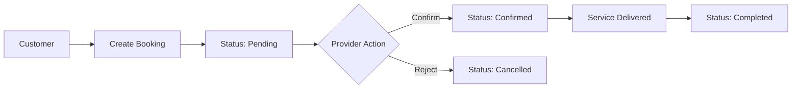
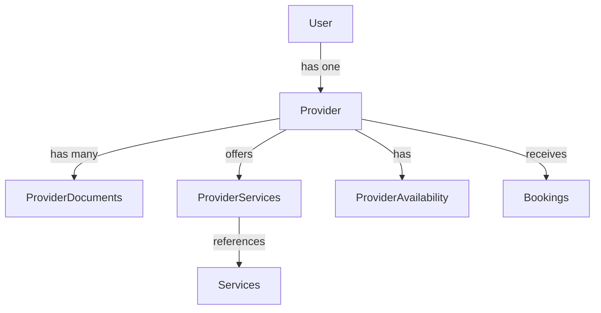

# Domain Modules

> **Deep dive into each business domain**

## Table of Contents

- [Overview](#overview)
- [Access Domain](#access-domain)
- [Booking Domain](#booking-domain)
- [Dashboard Domain](#dashboard-domain)
- [Identity Domain](#identity-domain)
- [Notification Domain](#notification-domain)
- [Provider Domain](#provider-domain)
- [SSO Domain](#sso-domain)
- [Tenant Domain](#tenant-domain)
- [Workflow Domain](#workflow-domain)

## Overview

The platform uses **Domain-Driven Design (DDD)** with 9 distinct business domains located in `app/Domains/`:

Each domain contains:
- `Models/` - Eloquent models
- `Services/` - Business logic
- `Repositories/` - Data access layer
- `Http/Controllers/` - HTTP endpoints
- `Events/` - Domain events
- `Enums/` - Domain-specific enums

## Access Domain

**Location**: `app/Domains/Access/`

**Purpose**: Role-Based Access Control (RBAC) and permission management

**Key Models:**
- `Role` - User roles with priority
- `Permission` - Granular permissions
- `Menu` - Dynamic sidebar menus
- `DashboardWidget` - Configurable widgets
- `ImpersonationLog` - Admin impersonation audit
- `Policy` - Complex authorization rules
- `PolicyAssignment` - Policy-to-resource assignments

**Services:**
- `RoleService` - Role CRUD and assignment
- `PermissionService` - Permission management  
- `PolicyService` - Policy evaluation
- `AccessEvaluationService` - Complex authorization logic

**Key Features:**
- Priority-based role system
- DB-driven menus and widgets
- Impersonation with full audit trail
- Policy engine for complex rules

**Database Tables:**
- `roles`
- `permissions`
- `role_permissions` (pivot)
- `user_roles` (pivot)
- `menus`
- `dashboard_widgets`
- `impersonation_logs`
- `policies`
- `policy_assignments`

[See RBAC Documentation →](rbac.md)

## Booking Domain

**Location**: `app/Domains/Booking/`

**Purpose**: Appointment/booking management

**Key Models:**
- `Booking` - Appointment record
- `Service` - Bookable services
- `BookingStatusHistory` - Status change audit trail

**Services:**
- `BookingService` - Create, update, confirm, cancel bookings
- `ServiceService` - Manage services catalog

**Enums:**
- `BookingStatus` - pending, confirmed, completed, cancelled
- `CancellationReason` - Various cancellation reasons

**Events:**
- `BookingCreated`
- `BookingConfirmed`
- `BookingCompleted`
- `BookingCancelled`
- `BookingReminder`

**Listeners:**
- `SendBookingConfirmation` - Email on confirmation
- `NotifyProviderNewBooking` - Alert provider
- `UpdateProviderAvailability` - Sync availability
- `SendBookingReminder` - Reminder notifications

**Workflow:**


## Dashboard Domain

**Location**: `app/Domains/Dashboard/`

**Purpose**: Dashboard widget management

**Key Models:**
- `DashboardWidget` - Widget configuration

**Key Features:**
- Permission-controlled widget visibility
- Configurable sort order
- JSON configuration per widget

**Integration:**
- Used by `DashboardService` to render role-specific dashboards
- Widgets resolved by `WidgetResolver`

## Identity Domain

**Location**: `app/Domains/Identity/`

**Purpose**: User authentication and identity management

**Key Models:**
- `User` - Primary user model
- `UserProfile` - Extended user information
- `UserSession` - Active session tracking
- `Tenant` - Organization/tenant
- `TenantConfig` - Tenant settings
- `TenantDomain` - Custom domains
- `TenantModule` - Feature flags per tenant
- `MfaMethod` - Multi-factor authentication (planned)

**Services:**
- `UserService` - User CRUD
- `TenantService` - Tenant management
- `AuthenticationService` - Login/logout logic

**Events:**
- `UserRegistered`
- `UserLoggedIn`
- `UserLoggedOut`
- `MfaEnabled`
- `EmailVerified`

**Key Features:**
- UUID (ULID) primary keys
- Tenant-scoped users
- Multi-role support
- Session management
- Account lockout after failed attempts

[See Authentication Documentation →](authentication.md)  
[See Tenancy Documentation →](tenancy.md)

## Notification Domain

**Location**: `app/Domains/Notification/`

**Purpose**: Multi-channel notification system

**Key Models:**
- `Notification` - Notification record
- `NotificationTemplate` - Reusable templates
- `NotificationPreference` - User preferences

**Channels (Planned):**
- Email
- SMS (Twilio)
- Push (Firebase)
- In-app

**Key Features:**
- Template-based notifications
- User opt-out preferences
- Delivery tracking

## Provider Domain

**Location**: `app/Domains/Provider/`

**Purpose**: Service provider management

**Key Models:**
- `Provider` - Provider profile
- `ProviderDocument` - Licenses, certifications
- `ProviderService` - Services offered by provider
- `ProviderAvailability` - Schedule and availability

**Key Features:**
- Document storage and verification
- Service catalog per provider
- Availability scheduling
- Approval workflow (pending → approved)

**Relationships:**


## SSO Domain

**Location**: `app/Domains/SSO/`

**Purpose**: Single Sign-On integration

**Key Models:**
- `TenantIdentityProvider` - SSO configuration per tenant

**Supported Providers:**
- OAuth 2.0 (Google, Facebook, Azure AD)
- SAML 2.0 (Okta, OneLogin)

**Services:**
- `SsoController` - OAuth token exchange
- SSO configuration per tenant

**Configuration Example:**
```json
{
    "provider": "google",
    "client_id": "abc123...",
    "client_secret": "xyz789...",
    "redirect_uri": "https://app.com/sso/callback"
}
```

## Tenant Domain

**Location**: `app/Domains/Tenant/`

**Purpose**: Tenant administration

**Key Models:**
- `Tenant` - Organization
- `TenantSettings` - Tenant-specific settings
- `TenantDomain` - Custom domains

**Services:**
- `TenantRepository` - Tenant queries
- Tenant provisioning logic

**Events:**
- `TenantCreated`
- `TenantSuspended`
- `TenantDeleted`

**Lifecycle:**
```
pending_setup → active → suspended → deleted
```

## Workflow Domain

**Location**: `app/Domains/Workflow/`

**Purpose**: Multi-step approval processes

**Key Models:**
- `WorkflowDefinition` - Reusable workflow template
- `Workflow` - Workflow instance
- `WorkflowStep` - Individual step in workflow
- `WorkflowEvent` - Event log
- `WorkflowForm` - Form data collection

**Key Features:**
- Multi-step approval chains
- Form-based data collection
- Event-driven triggers
- Status tracking

**Example Workflow:**
```
Provider Onboarding:
  Step 1: Submit application (form)
  Step 2: Document verification (approval)
  Step 3: Background check (approval)
  Step 4: Final approval (approval)
  → Provider status = "approved"
```

**Statuses:**
- `pending` - Not started
- `in_progress` - Active
- `completed` - All steps done
- `cancelled` - Aborted

## Cross-Links

- [Architecture](architecture.md) - DDD architecture
- [Models](models.md) - Model relationships
- [Database Schema](database-schema.md) - Table structures
- [Services](services-and-support.md) - Service layer
