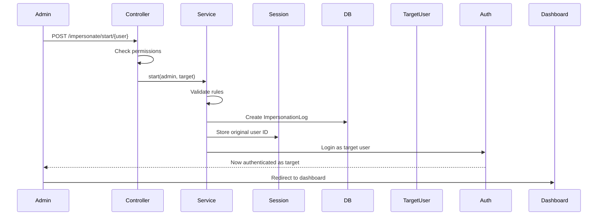
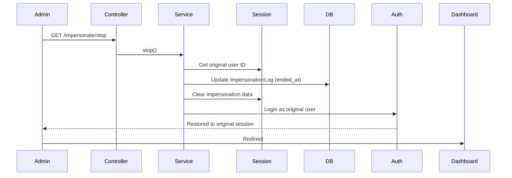

# Impersonation System

> **Secure user impersonation with complete audit trails**

## Table of Contents

- [Overview](#overview)
- [How Impersonation Works](#how-impersonation-works)
- [Security Model](#security-model)
- [Impersonation Flow](#impersonation-flow)
- [Audit Logging](#audit-logging)
- [Code Reference](#code-reference)
- [Best Practices](#best-practices)
- [Cross-Links](#cross-links)

## Overview

The impersonation system allows **authorized administrators** to temporarily log in as another user to:
- Troubleshoot user-specific issues
- Test multi-role permissions
- Provide customer support

**Key Security Features:**
- ✅ Full audit trail (who, when, how long)
- ✅ Prevention of privilege escalation
- ✅ Session isolation
- ✅ Easy "stop impersonation" mechanism

## How Impersonation Works

### Basic Concept

```
Admin (Alice) → Impersonates → User (Bob)
  ↓
Alice sees Bob's dashboard, Bob's permissions
  ↓
Alice clicks "Stop Impersonation"
  ↓
Alice returns to her own session
```

### Implementation

**Service:** [`app/Services/ImpersonationService.php`](file:///C:/Users/Victo/Downloads/backends/Bk-upflame/app/Services/ImpersonationService.php)

**Controller:** [`app/Http/Controllers/ImpersonationController.php`](file:///C:/Users/Victo/Downloads/backends/Bk-upflame/app/Http/Controllers/ImpersonationController.php)

**Routes:**
```php
Route::middleware(['auth'])->group(function () {
    Route::post('/impersonate/start/{user}', [ImpersonationController::class, 'start'])
        ->name('impersonate.start');
    
   Route::get('/impersonate/stop', [ImpersonationController::class, 'stop'])
        ->name('impersonate.stop');
});
```

## Security Model

### Who Can Impersonate?

```php
// app/Http/Controllers/ImpersonationController.php
public function start(User $targetUser)
{
    $currentUser = auth()->user();
    
    // 1. Only specific roles can impersonate
    if (!$currentUser->hasPermission('impersonate-users')) {
        abort(403, 'You do not have permission to impersonate users');
    }
    
    // 2. Cannot impersonate yourself
    if ($currentUser->id === $targetUser->id) {
        return back()->with('error', 'Cannot impersonate yourself');
    }
    
    // 3. Cannot impersonate higher-privilege users
    if ($targetUser->isSuperAdmin() && !$currentUser->isSuperAdmin()) {
        abort(403, 'Cannot impersonate a Super Admin');
    }
    
    // Start impersonation
    app(ImpersonationService::class)->start($currentUser, $targetUser);
    
    return redirect()->route('dashboard');
}
```

### Privilege Escalation Prevention

**Rules:**
1. Regular users **cannot** impersonate anyone
2. Tenant Admins **can** impersonate users within their tenant
3. Super Admins **can** impersonate anyone except other Super Admins
4. Impersonation loops **prevented** (can't impersonate while already impersonating)

## Impersonation Flow

### Start Impersonation



**Code:**
```php
// app/Services/ImpersonationService.php
public function start(User $impersonator, User $target): void
{
    // 1. Security checks
    if ($impersonator->id === $target->id) {
        throw new \Exception("Cannot impersonate yourself.");
    }
    
    if ($target->isSuperAdmin() && !$impersonator->isSuperAdmin()) {
        throw new \Exception("Cannot impersonate a Super Admin.");
    }
    
    // 2. Create audit log
    $log = ImpersonationLog::create([
        'impersonator_id' => $impersonator->id,
        'impersonated_id' => $target->id,
        'tenant_id' => $target->tenant_id,
        'started_at' => now(),
        'ip_address' => request()->ip(),
        'user_agent' => request()->userAgent(),
    ]);
    
    // 3. Store state in session
    Session::put('impersonation_original_user_id', $impersonator->id);
    Session::put('impersonation_log_id', $log->id);
    
    // 4. Login as target
    Auth::login($target);
}
```

### Stop Impersonation



**Code:**
```php
public function stop(): void
{
    if (!$this->isImpersonating()) {
        return;
    }
    
    $originalUserId = Session::get ('impersonation_original_user_id');
    $logId = Session::get('impersonation_log_id');
    
    // 1. Update audit log
    if ($logId) {
        $log = ImpersonationLog::find($logId);
        if ($log) {
            $log->update(['ended_at' => now()]);
        }
    }
    
    // 2. Clear session
    Session::forget('impersonation_original_user_id');
    Session::forget('impersonation_log_id');
    
    // 3. Login back as original user
    $originalUser = User::find($originalUserId);
    if ($originalUser) {
        Auth::login($originalUser);
    } else {
        Auth::logout(); // Fallback
    }
}
```

### Check If Impersonating

```php
public function isImpersonating(): bool
{
    return Session::has('impersonation_original_user_id');
}

public function getImpersonator(): ?User
{
    if (!$this->isImpersonating()) {
        return null;
    }
    
    return User::find(Session::get('impersonation_original_user_id'));
}
```

## Audit Logging

### ImpersonationLog Model

[`app/Domains/Access/Models/ImpersonationLog.php`](file:///C:/Users/Victo/Downloads/backends/Bk-upflame/app/Domains/Access/Models/ImpersonationLog.php)

**Schema:**
```sql
CREATE TABLE impersonation_logs (
    id VARCHAR(26) PRIMARY KEY,
    impersonator_id VARCHAR(26) NOT NULL,   -- Who started impersonation
    impersonated_id VARCHAR(26) NOT NULL,   -- Who was impersonated
    tenant_id VARCHAR(26) NULL,             -- Context tenant
    started_at TIMESTAMP NOT NULL,
    ended_at TIMESTAMP NULL,                -- NULL = still active
    ip_address VARCHAR(45),
    user_agent TEXT,
    
    FOREIGN KEY (impersonator_id) REFERENCES users(id),
    FOREIGN KEY (impersonated_id) REFERENCES users(id),
    FOREIGN KEY (tenant_id) REFERENCES tenants(id),
    
    INDEX idx_impersonator (impersonator_id),
    INDEX idx_active (ended_at)
);
```

### Querying Audit Logs

```php
// Get all impersonation sessions
$logs = ImpersonationLog::with(['impersonator', 'impersonated'])
    ->orderBy('started_at', 'desc')
    ->get();

// Find active impersonation sessions
$active = ImpersonationLog::whereNull('ended_at')->get();

// Impersonations by a specific admin
$adminLogs = ImpersonationLog::where('impersonator_id', $adminId)
    ->get();

// Duration calculation
$log->duration = $log->started_at->diffInMinutes($log->ended_at ?? now());
```

## Code Reference

### Middleware: CheckImpersonation

[`app/Http/Middleware/CheckImpersonation.php`](file:///C:/Users/Victo/Downloads/backends/Bk-upflame/app/Http/Middleware/CheckImpersonation.php):

```php
class CheckImpersonation
{
    public function handle(Request $request, Closure $next)
    {
        $service = app(ImpersonationService::class);
        
        if ($service->isImpersonating()) {
            // Add impersonation banner to view
            view()->share('impersonating', true);
            view()->share('impersonator', $service->getImpersonator());
        }
        
        return $next($request);
    }
}
```

### UI Banner

Show banner when impersonating:

```blade
<!-- resources/views/layouts/app.blade.php -->
@if (session()->has('impersonation_original_user_id'))
    <div class="impersonation-banner">
        <div class="container">
            <p>
                <strong>⚠️ Impersonating:</strong> {{ auth()->user()->email }}
                <a href="{{ route('impersonate.stop') }}" class="btn btn-sm">
                    Stop Impersonation
                </a>
            </p>
        </div>
    </div>
@endif
```

**Styling:**
```css
.impersonation-banner {
    background: #ff9800;
    color: #fff;
    padding: 10px 0;
    text-align: center;
    position: fixed;
    top: 0;
    width: 100%;
    z-index: 9999;
}
```

## Best Practices

### ✅ DO

1. **Log all impersonation sessions** for compliance
2. **Display prominent banner** when impersonating
3. **Limit impersonation permission** to trusted admins
4. **Prevent privilege escalation** (can't impersonate higher roles)
5. **Set session timeouts** for impersonation
6. **Monitor impersonation logs** for abuse

### ❌ DON'T

1. **Don't allow impersonation loops** (impersonate while impersonating)
2. **Don't hide impersonation status** from UI
3. **Don't grant impersonation permission widely**
4. **Don't skip audit logging**
5. **Don't allow permanent impersonation** (add timeouts)

### Recommended: Auto-Stop Impersonation

Add timeout to prevent forgotten impersonation sessions:

```php
// In middleware
if ($service->isImpersonating()) {
    $log = ImpersonationLog::find(session('impersonation_log_id'));
    
    // Auto-stop after 1 hour
    if ($log && $log->started_at->diffInMinutes(now()) > 60) {
        $service->stop();
        return redirect('/dashboard')
            ->with('info', 'Impersonation session expired');
    }
}
```

## Cross-Links

- [Security](security.md) - Security considerations
- [RBAC](rbac.md) - Permission system for impersonation
- [Logging & Auditing](logging-and-auditing.md) - Audit trail details
- [Authentication](authentication.md) - Session management
