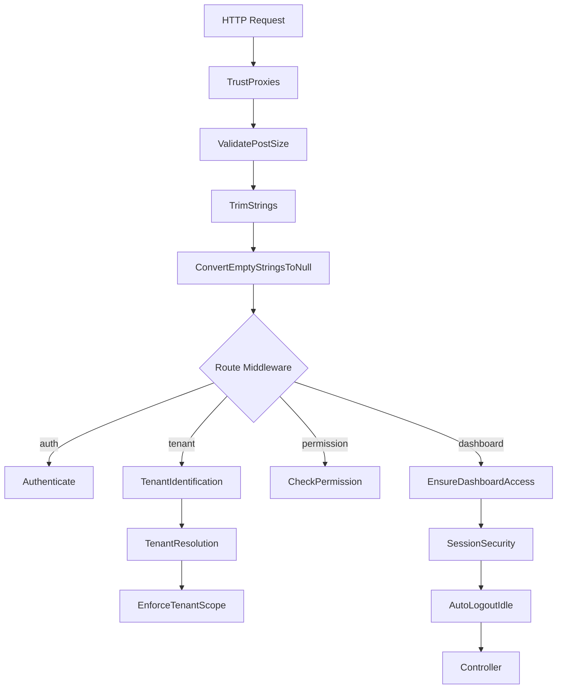

# Middleware

> **HTTP middleware stack and custom middleware implementations**

## Table of Contents

- [Overview](#overview)
- [Middleware Stack](#middleware-stack)
- [Custom Middleware](#custom-middleware)
- [Global Middleware](#global-middleware)
- [Route Middleware](#route-middleware)  
- [Middleware Groups](#middleware-groups)
- [Creating Custom Middleware](#creating-custom-middleware)
- [Best Practices](#best-practices)
- [Cross-Links](#cross-links)

## Overview

Middleware provides a mechanism for **filtering HTTP requests** entering the application. The platform uses middleware for authentication, authorization, tenant scoping, CSRF protection, and session management.

## Middleware Stack

### Execution Order



## Custom Middleware

### TenantIdentification

**Purpose**: Identify and set tenant context from request

**Location**: [`app/Http/Middleware/TenantIdentification.php`](file:///C:/Users/Victo/Downloads/backends/Bk-upflame/app/Http/Middleware/TenantIdentification.php)

```php
class TenantIdentification
{
    public function handle(Request $request, Closure $next)
    {
        // Identify tenant based on strategy (domain/subdomain/header)
        $tenantId = $this->identifyTenant($request);
        
        if ($tenantId) {
            // Set in application context
            app()->singleton('tenant.id', fn() => $tenantId);
            
            // Attach to request
            $request->attributes->set('tenant_id', $tenantId);
        }
        
        return $next($request);
    }
    
    protected function identifyTenant(Request $request)
    {
        $strategy = config('tenant.identification_strategy');
        
        return match ($strategy) {
            'domain' => $this->identifyByDomain($request),
            'subdomain' => $this->identifyBySubdomain($request),
            'header' => $this->identifyByHeader($request),
            default => null,
        };
    }
}
```

**Usage:**
```php
Route::middleware('tenant.identify')->group(function () {
    // Routes with tenant context
});
```

### CheckPermission

**Purpose**: Verify user has required permission

**Location**: [`app/Http/Middleware/CheckPermission.php`](file:///C:/Users/Victo/Downloads/backends/Bk-upflame/app/Http/Middleware/CheckPermission.php)

```php
class CheckPermission
{
    public function handle(Request $request, Closure $next, string $permission): Response
    {
        if (!$request->user() || !$request->user()->hasPermission($permission)) {
            if ($request->expectsJson()) {
                return response()->json(['message' => 'Forbidden'], 403);
            }
            abort(403, 'Unauthorized action.');
        }
        
        return $next($request);
    }
}
```

**Usage:**
```php
Route::middleware('permission:delete-user')
    ->delete('/users/{user}', [UserController::class, 'destroy']);
```

### EnsureDashboardAccess

**Purpose**: Ensure user can access dashboard

**Location**: [`app/Http/Middleware/EnsureDashboardAccess.php`](file:///C:/Users/Victo/Downloads/backends/Bk-upflame/app/Http/Middleware/EnsureDashboardAccess.php)

```php
class EnsureDashboardAccess
{
    public function handle(Request $request, Closure $next)
    {
        $user = $request->user();
        
        if (!$user) {
            return redirect()->route('login');
        }
        
        // Check if user is active
        if (!$user->isActive()) {
            Auth::logout();
            return redirect()->route('login')
                ->with('error', 'Your account is inactive');
        }
        
        // Check if user has at least one role
        if ($user->roles()->count() === 0) {
            return response()->view('errors.no-role', [], 403);
        }
        
        return $next($request);
    }
}
```

### SessionSecurity

**Purpose**: Prevent session hijacking

**Location**: [`app/Http/Middleware/SessionSecurity.php`](file:///C:/Users/Victo/Downloads/backends/Bk-upflame/app/Http/Middleware/SessionSecurity.php)

```php
class SessionSecurity
{
    public function handle(Request $request, Closure $next)
    {
        if ($this->sessionHijacked($request)) {
            Auth::logout();
            return redirect('/login')
                ->with('error', 'Session security check failed');
        }
        
        $this->updateSessionActivity($request);
        
        return $next($request);
    }
    
    protected function sessionHijacked(Request $request): bool
    {
        $storedFingerprint = session('fingerprint');
        
        if (!$storedFingerprint) {
            session(['fingerprint' => $this->generateFingerprint($request)]);
            return false;
        }
        
        return $storedFingerprint !== $this->generateFingerprint($request);
    }
    
    protected function generateFingerprint(Request $request): string
    {
        return hash('sha256', $request->userAgent() . $request->ip());
    }
}
```

### AutoLogoutIdle

**Purpose**: Auto-logout after idle timeout

**Location**: [`app/Http/Middleware/AutoLogoutIdle.php`](file:///C:/Users/Victo/Downloads/backends/Bk-upflame/app/Http/Middleware/AutoLogoutIdle.php)

```php
class AutoLogoutIdle
{
    public function handle(Request $request, Closure $next)
    {
        $timeout = config('dashboard.idle_timeout', 30); // minutes
        
        if ($timeout > 0) {
            $lastActivity = session('last_activity_time');
            
            if ($lastActivity && now()->diffInMinutes($lastActivity) > $timeout) {
                Auth::logout();
                return redirect('/login')
                    ->with('info', 'Logged out due to inactivity');
            }
            
            session(['last_activity_time' => now()]);
        }
        
        return $next($request);
    }
}
```

### AuditLogger

**Purpose**: Log sensitive operations

**Location**: [`app/Http/Middleware/AuditLogger.php`](file:///C:/Users/Victo/Downloads/backends/Bk-upflame/app/Http/Middleware/AuditLogger.php)

```php
class AuditLogger
{
    public function handle(Request $request, Closure $next)
    {
        $response = $next($request);
        
        // Log mutating operations
        if (in_array($request->method(), ['POST', 'PUT', 'PATCH', 'DELETE'])) {
            AccessLog::create([
                'user_id' => auth()->id(),
                'tenant_id' => app('tenant.id'),
                'action' => $request->route()->getName(),
                'resource_type' => $this->getResourceType($request),
                'resource_id' => $this->getResourceId($request),
                'ip_address' => $request->ip(),
                'user_agent' => $request->userAgent(),
            ]);
        }
        
        return $response;
    }
}
```

### CheckImpersonation

**Purpose**: Track impersonation status for UI

**Location**: [`app/Http/Middleware/CheckImpersonation.php`](file:///C:/Users/Victo/Downloads/backends/Bk-upflame/app/Http/Middleware/CheckImpersonation.php)

```php
class CheckImpersonation
{
    public function handle(Request $request, Closure $next)
    {
        $service = app(ImpersonationService::class);
        
        if ($service->isImpersonating()) {
            // Share with views
            view()->share('impersonating', true);
            view()->share('impersonator', $service->getImpersonator());
        }
        
        return $next($request);
    }
}
```

## Global Middleware

Runs on **every request**:

**`app/Http/Kernel.php`:**
```php
protected $middleware = [
    \App\Http\Middleware\TrustProxies::class,
    \Illuminate\Http\Middleware\ValidatePostSize::class,
    \App\Http\Middleware\TrimStrings::class,
    \Illuminate\Foundation\Http\Middleware\ConvertEmptyStringsToNull::class,
];
```

## Route Middleware

Applied to **specific routes**:

```php
protected $middlewareAliases = [
    'auth' => \App\Http\Middleware\Authenticate::class,
    'auth.basic' => \Illuminate\Auth\Middleware\AuthenticateWithBasicAuth::class,
    'auth.session' => \Illuminate\Session\Middleware\AuthenticateSession::class,
    'cache.headers' => \Illuminate\Http\Middleware\SetCacheHeaders::class,
    'can' => \Illuminate\Auth\Middleware\Authorize::class,
    'guest' => \App\Http\Middleware\RedirectIfAuthenticated::class,
    'password.confirm' => \Illuminate\Auth\Middleware\RequirePassword::class,
    'throttle' => \Illuminate\Routing\Middleware\ThrottleRequests::class,
    'verified' => \Illuminate\Auth\Middleware\EnsureEmailIsVerified::class,
    
    // Custom middleware
    'tenant.identify' => \App\Http\Middleware\TenantIdentification::class,
    'tenant.scope' => \App\Http\Middleware\EnforceTenantScope::class,
    'permission' => \App\Http\Middleware\CheckPermission::class,
    'dashboard.access' => \App\Http\Middleware\EnsureDashboardAccess::class,
    'session.security' => \App\Http\Middleware\SessionSecurity::class,
    'auto.logout' => \App\Http\Middleware\AutoLogoutIdle::class,
    'audit.log' => \App\Http\Middleware\AuditLogger::class,
];
```

## Middleware Groups

Pre-defined groups for common stacks:

```php
protected $middlewareGroups = [
    'web' => [
        \App\Http\Middleware\EncryptCookies::class,
        \Illuminate\Cookie\Middleware\AddQueuedCookiesToResponse::class,
        \Illuminate\Session\Middleware\StartSession::class,
        \Illuminate\View\Middleware\ShareErrorsFromSession::class,
        \App\Http\Middleware\VerifyCsrfToken::class,
        \Illuminate\Routing\Middleware\SubstituteBindings::class,
    ],
    
    'api' => [
        \Laravel\Sanctum\Http\Middleware\EnsureFrontendRequestsAreStateful::class,
        \Illuminate\Routing\Middleware\ThrottleRequests::class.':api',
        \Illuminate\Routing\Middleware\SubstituteBindings::class,
    ],
];
```

## Creating Custom Middleware

### Generate Middleware

```bash
php artisan make:middleware EnsureTenantActive
```

### Implementation Template

```php
<?php

namespace App\Http\Middleware;

use Closure;
use Illuminate\Http\Request;
use Symfony\Component\HttpFoundation\Response;

class EnsureTenantActive
{
    public function handle(Request $request, Closure $next): Response
    {
        $tenantId = app('tenant.id');
        
        if (!$tenantId) {
            abort(403, 'No tenant context');
        }
        
        $tenant = \App\Domains\Identity\Models\Tenant::find($tenantId);
        
        if (!$tenant || $tenant->status !== 'active') {
            abort(403, 'Tenant is not active');
        }
        
        return $next($request);
    }
}
```

### Register Middleware

**`app/Http/Kernel.php`:**
```php
protected $middlewareAliases = [
    // ...
    'tenant.active' => \App\Http\Middleware\EnsureTenantActive::class,
];
```

### Use in Routes

```php
Route::middleware(['auth', 'tenant.active'])->group(function () {
    Route::get('/dashboard', [DashboardController::class, 'index']);
});
```

## Best Practices

### ✅ DO

1. **Keep middleware focused** - Single responsibility
2. **Use early returns** for failed checks
3. **Cache expensive operations** (permission checks, etc.)
4. **Log security events** (failed auth, etc.)
5. **Return proper HTTP status codes**

### ❌ DON'T

1. **Don't put business logic** in middleware
2. **Don't query database excessively**
3. **Don't modify request** unless necessary
4. **Don't forget error handling**

## Cross-Links

- [Authentication](authentication.md) - Auth middleware
- [Security](security.md) - Session security
- [RBAC](rbac.md) - Permission middleware
- [Tenancy](tenancy.md) - Tenant scoping middleware
- [Routes](routes.md) - Route definitions with middleware
