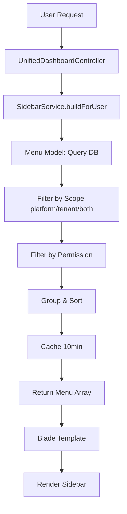
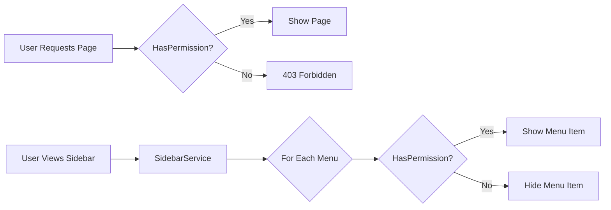

# Dynamic Sidebar & Menu System

**Version:** 1.0  
**Last Updated:** November 2025  
**Status:** Production Ready

---

## Table of Contents

1. [Overview](#overview)
2. [System Architecture](#system-architecture)
3. [Creating a New Feature (Complete Workflow)](#creating-a-new-feature-complete-workflow)
4. [Permission-Based Access Control](#permission-based-access-control)
5. [Menu Management](#menu-management)
6. [Advanced Patterns](#advanced-patterns)
7. [Troubleshooting](#troubleshooting)
8. [Best Practices](#best-practices)

---

## Overview

### What is This System?

This application uses a **database-driven, permission-aware, multi-tenant sidebar system** that dynamically renders navigation based on:
- User's role and permissions
- User's tenant context (platform vs tenant-scoped)
- Menu configuration stored in the `menus` table

### Key Benefits

✅ **No Code Deployments**: Add/remove menu items via database  
✅ **Permission-Aware**: Auto-hides menu items users can't access  
✅ **Multi-Tenant Safe**: Platform menus for Super Admin, Tenant menus for Tenant Admin  
✅ **Cached Performance**: 10-minute cache per user  
✅ **Icon Support**: FontAwesome icons  
✅ **Hierarchical Groups**: Organized menu groups

---

## System Architecture

### Component Overview



### Database Schema

#### `menus` Table

| Column | Type | Description | Example |
|--------|------|-------------|---------|
| `id` | ULID | Primary key | `01JDXXX...` |
| `parent_id` | ULID (nullable) | For nested menus | `null` |
| `label` | string | Display name | `"Roles & Permissions"` |
| `route` | string | Laravel route name | `"admin.roles.index"` |
| `url` | string (nullable) | External URL | `null` |
| `icon` | string | FontAwesome class | `"fa-shield-alt"` |
| `group` | string | Group name | `"Access Control"` |
| `group_order` | integer | Group sort | `1` |
| `sort_order` | integer | Item sort within group | `1` |
| `scope` | enum | `platform`, `tenant`, `both` | `"platform"` |
| `required_permissions` | JSON | Array of permissions | `["platform.role.view"]` |
| `is_active` | boolean | Enabled/disabled | `true` |
| `meta` | JSON | Custom metadata | `{}` |

#### `permissions` Table

| Column | Type | Description | Example |
|--------|------|-------------|---------|
| `id` | ULID | Primary key | `01JDXXX...` |
| `tenant_id` | ULID (nullable) | Tenant scope (null = platform) | `null` |
| `name` | string | Unique permission name | `"platform.role.view"` |
| `resource` | string | Resource module | `"platform_role"` |
| `action` | string | Action type | `"view"` |
| `description` | string | Human-readable | `"View all roles"` |

#### `roles` Table

| Column | Type | Description | Example |
|--------|------|-------------|---------|
| `id` | ULID | Primary key | `01JDXXX...` |
| `tenant_id` | ULID (nullable) | Tenant scope | `null` |
| `name` | string | Role name | `"Super Admin"` |
| `priority` | integer | Lower = higher priority | `1` |
| `is_system` | boolean | System role (protected) | `true` |

---

## Creating a New Feature (Complete Workflow)

### Example: Creating a "Reports" Feature

We'll create a complete feature with controller, views, routes, permissions, and sidebar menu.

---

### Step 1: Define Permissions

**File:** `database/seeders/ReportsPermissionSeeder.php`

```php
<?php

namespace Database\Seeders;

use App\Domains\Access\Models\Permission;
use Illuminate\Database\Seeder;

class ReportsPermissionSeeder extends Seeder
{
    public function run(): void
    {
        $permissions = [
            // Platform-level (Super Admin)
            [
                'name' => 'platform.report.view',
                'resource' => 'platform_report',
                'action' => 'view',
                'description' => 'View all reports across tenants',
                'tenant_id' => null,
            ],
            [
                'name' => 'platform.report.export',
                'resource' => 'platform_report',
                'action' => 'export',
                'description' => 'Export reports (all tenants)',
                'tenant_id' => null,
            ],
            
            // Tenant-level (Tenant Admin)
            [
                'name' => 'tenant.report.view',
                'resource' => 'tenant_report',
                'action' => 'view',
                'description' => 'View tenant reports',
                'tenant_id' => null,
            ],
            [
                'name' => 'tenant.report.export',
                'resource' => 'tenant_report',
                'action' => 'export',
                'description' => 'Export tenant reports',
                'tenant_id' => null,
            ],
        ];

        foreach ($permissions as $permData) {
            Permission::firstOrCreate(
                ['name' => $permData['name']],
                $permData
            );
        }
    }
}
```

**Run seeder:**
```bash
php artisan db:seed --class=ReportsPermissionSeeder
```

---

### Step 2: Assign Permissions to Roles

**Option A: Via Seeder (Recommended for initial setup)**

```php
// In database/seeders/RoleSeeder.php or create new AssignReportsPermissionsSeeder.php
$superAdminRole = Role::where('name', 'Super Admin')->first();
$platformReportPerms = Permission::where('resource', 'platform_report')->pluck('id');
$superAdminRole->permissions()->syncWithoutDetaching($platformReportPerms);

$tenantAdminRole = Role::where('name', 'Tenant Admin')->first();
$tenantReportPerms = Permission::where('resource', 'tenant_report')->pluck('id');
$tenantAdminRole->permissions()->syncWithoutDetaching($tenantReportPerms);
```

**Option B: Via Admin UI**
1. Login as Super Admin
2. Navigate to `/admin/roles`
3. Edit "Super Admin" role
4. Check `platform.report.view` and `platform.report.export`
5. Save

---

### Step 3: Create Controller

**File:** `app/Http/Controllers/Admin/ReportController.php`

```php
<?php

namespace App\Http\Controllers\Admin;

use App\Http\Controllers\Controller;
use Illuminate\Http\Request;

class ReportController extends Controller
{
    /**
     * Display a listing of reports
     */
    public function index()
    {
        // Check permission
        if (!auth()->user()->hasPermission('platform.report.view')) {
            abort(403, 'Unauthorized action');
        }

        // Your logic here
        $reports = []; // Fetch reports

        return view('admin.reports.index', compact('reports'));
    }

    /**
     * Export report
     */
    public function export(Request $request)
    {
        if (!auth()->user()->hasPermission('platform.report.export')) {
            abort(403, 'Unauthorized action');
        }

        // Export logic
        return response()->download($filePath);
    }
}
```

**For Tenant-scoped controller:**

**File:** `app/Http/Controllers/Tenant/ReportController.php`

```php
<?php

namespace App\Http\Controllers\Tenant;

use App\Http\Controllers\Controller;
use Illuminate\Http\Request;
use Illuminate\Support\Facades\Auth;

class ReportController extends Controller
{
    public function index()
    {
        if (!auth()->user()->hasPermission('tenant.report.view')) {
            abort(403, 'Unauthorized action');
        }

        // Automatically scoped to auth()->user()->tenant_id
        $reports = Report::where('tenant_id', Auth::user()->tenant_id)->get();

        return view('tenant.reports.index', compact('reports'));
    }
}
```

---

### Step 4: Create Views

**File:** `resources/views/admin/reports/index.blade.php`

```blade
@extends('layouts.dashboard')

@section('title', 'Reports')

@section('content')
<div class="container-fluid">
    <div class="row mb-4">
        <div class="col-md-12">
            <h2>Reports</h2>
        </div>
    </div>

    <div class="row">
        <div class="col-md-12">
            <div class="card">
                <div class="card-body">
                    <p>Your reports content here</p>
                </div>
            </div>
        </div>
    </div>
</div>
@endsection
```

---

### Step 5: Define Routes

**File:** `routes/web.php`

```php
// Super Admin Routes
Route::middleware(['auth'])->prefix('admin')->name('admin.')->group(function () {
    // Existing routes...
    
    // Reports
    Route::get('reports', [\App\Http\Controllers\Admin\ReportController::class, 'index'])
        ->name('reports.index');
    Route::post('reports/export', [\App\Http\Controllers\Admin\ReportController::class, 'export'])
        ->name('reports.export');
});

// Tenant Admin Routes
Route::middleware(['auth'])->prefix('tenant')->name('tenant.')->group(function () {
    // Existing routes...
    
    // Reports (tenant-scoped)
    Route::get('reports', [\App\Http\Controllers\Tenant\ReportController::class, 'index'])
        ->name('reports.index');
});
```

---

### Step 6: Add Menu Item to Sidebar

**Option A: Via Seeder (Recommended for version control)**

**File:** `database/seeders/ReportsMenuSeeder.php`

```php
<?php

namespace Database\Seeders;

use App\Domains\Access\Models\Menu;
use Illuminate\Database\Seeder;

class ReportsMenuSeeder extends Seeder
{
    public function run(): void
    {
        $menus = [
            // Super Admin menu
            [
                'label' => 'Reports',
                'route' => 'admin.reports.index',
                'icon' => 'fa-chart-bar',
                'group' => 'Analytics',
                'group_order' => 3,
                'sort_order' => 1,
                'scope' => 'platform',
                'required_permissions' => ['platform.report.view'],
                'is_active' => true,
            ],
            
            // Tenant Admin menu
            [
                'label' => 'Reports',
                'route' => 'tenant.reports.index',
                'icon' => 'fa-chart-line',
                'group' => 'Analytics',
                'group_order' => 3,
                'sort_order' => 1,
                'scope' => 'tenant',
                'required_permissions' => ['tenant.report.view'],
                'is_active' => true,
            ],
        ];

        foreach ($menus as $menuData) {
            Menu::firstOrCreate(
                [
                    'route' => $menuData['route'],
                    'scope' => $menuData['scope'],
                ],
                $menuData
            );
        }
    }
}
```

**Run seeder:**
```bash
php artisan db:seed --class=ReportsMenuSeeder
```

**Option B: Via Database (for quick testing)**

```sql
INSERT INTO menus (id, label, route, icon, `group`, group_order, sort_order, scope, required_permissions, is_active, created_at, updated_at)
VALUES (
    '01JDXXXXXXXXXXXXXXXXXXXXXXXX',  -- Generate ULID
    'Reports',
    'admin.reports.index',
    'fa-chart-bar',
    'Analytics',
    3,
    1,
    'platform',
    '["platform.report.view"]',
    1,
    NOW(),
    NOW()
);
```

**Option C: Via Tinker (for debugging)**

```bash
php artisan tinker
```

```php
App\Domains\Access\Models\Menu::create([
    'label' => 'Reports',
    'route' => 'admin.reports.index',
    'icon' => 'fa-chart-bar',
    'group' => 'Analytics',
    'group_order' => 3,
    'sort_order' => 1,
    'scope' => 'platform',
    'required_permissions' => ['platform.report.view'],
    'is_active' => true,
]);
```

---

### Step 7: Clear Cache & Test

```bash
# Clear all caches
php artisan cache:clear

# If using Redis
php artisan cache:forget sidebar_menu_1
php artisan cache:forget sidebar_menu_2
```

**Test:**
1. Logout and login as Super Admin
2. Check sidebar - should see "Reports" under "Analytics" group
3. Click on "Reports"
4. Should navigate to `/admin/reports`

---

## Permission-Based Access Control

### How Permissions Work

#### 1. **Permission Check Flow**



#### 2. **Permission Naming Convention**

```
{scope}.{resource}.{action}
```

**Examples:**
- `platform.role.view` - Super Admin can view all roles
- `tenant.user.create` - Tenant Admin can create users in their tenant
- `booking.view` - Any role can view bookings (no scope prefix)

**Scope Prefixes:**
- `platform.*` - Super Admin only (cross-tenant)
- `tenant.*` - Tenant Admin only (tenant-scoped)
- No prefix - Domain-specific (e.g., `booking.create`, `finance.approve`)

#### 3. **Checking Permissions in Code**

**In Controllers:**
```php
public function index()
{
    if (!auth()->user()->hasPermission('platform.report.view')) {
        abort(403, 'Unauthorized action');
    }
    
    // Your code
}
```

**In Blade Templates:**
```blade
@if(auth()->user()->hasPermission('platform.report.export'))
    <a href="{{ route('admin.reports.export') }}" class="btn btn-primary">
        Export
    </a>
@endif
```

**In Routes (Middleware):**
```php
// Coming soon: CheckPermission middleware
Route::get('reports', [ReportController::class, 'index'])
    ->middleware('permission:platform.report.view');
```

#### 4. **User Has Permission Check (Internal)**

**File:** `app/Domains/Identity/Models/User.php`

```php
public function hasPermission(string $permission): bool
{
    foreach ($this->roles as $role) {
        if ($role->permissions->contains('name', $permission)) {
            return true;
        }
    }
    return false;
}
```

---

## Menu Management

### Menu Attributes Explained

| Attribute | Purpose | Example | Notes |
|-----------|---------|---------|-------|
| **label** | Display name in sidebar | `"User Management"` | User-facing text |
| **route** | Laravel route name | `"admin.users.index"` | Must exist in `routes/web.php` |
| **url** | External link (optional) | `"https://example.com"` | If set, overrides `route` |
| **icon** | FontAwesome icon class | `"fa-users"` | Prefix `fa-` required |
| **group** | Menu group name | `"Access Control"` | Groups items together |
| **group_order** | Group position | `1`, `2`, `3` | Lower = appears first |
| **sort_order** | Item position within group | `1`, `2`, `3` | Lower = appears first |
| **scope** | Visibility scope | `platform`, `tenant`, `both` | Filters by user type |
| **required_permissions** | JSON array | `["platform.user.view"]` | User must have ANY permission |
| **is_active** | Enable/disable | `true`, `false` | Soft delete alternative |
| **meta** | Custom data (optional) | `{"badge": "New"}` | For future extensions |

### Scope Behavior

| Scope Value | Who Sees It? | Use Case |
|-------------|-------------|----------|
| `platform` | Super Admin only | Cross-tenant management (roles, users, tenants) |
| `tenant` | Tenant Admin only | Tenant-scoped management (team members, settings) |
| `both` | Everyone | Common features (dashboard, profile, logout) |

### Menu Filtering Logic

**File:** `app/Domains/Access/Models/Menu.php`

```php
public function scopeForUser($query, $user)
{
    $query->where(function ($q) use ($user) {
        $q->where('scope', 'both');
        
        if ($user->isSuperAdmin()) {
            $q->orWhere('scope', 'platform');
        } else {
            $q->orWhere('scope', 'tenant');
        }
    });

    return $query;
}

public function isAccessibleBy($user): bool
{
    if (empty($this->required_permissions)) {
        return true; // No permission required
    }

    // Check if user has ANY of the required permissions
    foreach ($this->required_permissions as $permission) {
        if ($user->hasPermission($permission)) {
            return true;
        }
    }

    return false;
}
```

---

## Advanced Patterns

### Pattern 1: Conditional Menus

**Use Case:** Show "Approve Bookings" only if there are pending approvals

**Implementation:**

1. Add `meta` field to menu:
```php
Menu::create([
    'label' => 'Pending Approvals',
    'route' => 'bookings.pending',
    'meta' => ['show_if_count' => true],
    // ... other fields
]);
```

2. Extend `SidebarService`:
```php
protected function buildMenuStructure(User $user): array
{
    // Existing logic...
    
    foreach ($menus as $menu) {
        // Existing checks...
        
        // Custom meta check
        if (isset($menu->meta['show_if_count']) && $menu->meta['show_if_count']) {
            $count = Booking::where('status', 'pending')->count();
            if ($count == 0) {
                continue; // Skip this menu
            }
            $menu->label .= " ($count)"; // Add badge
        }
        
        $groupedItems[$menu->group][] = $menu;
    }
}
```

### Pattern 2: Nested Menus (Dropdowns)

**Database Structure:**
```php
// Parent menu
Menu::create([
    'id' => 'parent-id-123',
    'label' => 'Settings',
    'route' => null, // No route for parent
    'icon' => 'fa-cog',
    'parent_id' => null,
]);

// Child menu
Menu::create([
    'label' => 'General Settings',
    'route' => 'settings.general',
    'parent_id' => 'parent-id-123', // Link to parent
]);
```

**Note:** Current `SidebarService` supports flat menus only. Nested menus require frontend JavaScript for dropdowns.

### Pattern 3: Dynamic Badges

**Add badge count to menu items:**

```php
// In SidebarService
protected function buildMenuStructure(User $user): array
{
    // ...existing code...
    
    foreach ($groupedItems as $group => $items) {
        foreach ($items as $item) {
            // Add badge for notifications
            if ($item->route === 'notifications.index') {
                $unreadCount = Notification::where('user_id', $user->id)
                    ->where('read_at', null)
                    ->count();
                $item->badge = $unreadCount > 0 ? $unreadCount : null;
            }
        }
    }
}
```

**Blade Template:**
```blade
@if(isset($menuItem['badge']) && $menuItem['badge'] > 0)
    <span class="badge badge-danger">{{ $menuItem['badge'] }}</span>
@endif
```

---

## Troubleshooting

### Issue 1: Menu Not Showing

**Symptoms:** New menu item doesn't appear in sidebar

**Checklist:**
1. ✅ Menu exists in database
   ```bash
   php artisan tinker
   App\Domains\Access\Models\Menu::where('route', 'your.route')->first()
   ```

2. ✅ Menu is active
   ```sql
   SELECT * FROM menus WHERE route = 'your.route' AND is_active = 1;
   ```

3. ✅ User has required permission
   ```php
   $user = auth()->user();
   $user->hasPermission('required.permission');
   ```

4. ✅ Scope matches user type
   - Super Admin? Scope should be `platform` or `both`
   - Tenant Admin? Scope should be `tenant` or `both`

5. ✅ Cache cleared
   ```bash
   php artisan cache:clear
   ```

6. ✅ User logged out and back in
   - Permissions are loaded on login
   - Logout/login refreshes session

7. ✅ Route exists
   ```bash
   php artisan route:list --name=your.route
   ```

### Issue 2: Permission Denied (403)

**Symptoms:** Menu shows but clicking gives 403 error

**Cause:** User can see menu but controller denies access

**Solution:**
1. Check controller permission:
   ```php
   if (!auth()->user()->hasPermission('required.permission')) {
       abort(403);
   }
   ```

2. Verify role has permission:
   ```bash
   php artisan tinker
   ```
   ```php
   $user = User::find(1);
   $user->roles->first()->permissions->pluck('name')
   ```

3. Assign missing permission:
   ```php
   $role = Role::where('name', 'Super Admin')->first();
   $perm = Permission::where('name', 'required.permission')->first();
   $role->permissions()->attach($perm->id);
   ```

### Issue 3: Menu Shows for Wrong User Type

**Symptoms:** Tenant Admin sees platform menus (or vice versa)

**Cause:** Incorrect `scope` value

**Solution:**
```sql
-- Check scope
SELECT label, scope FROM menus WHERE route = 'problematic.route';

-- Fix scope
UPDATE menus SET scope = 'platform' WHERE route = 'admin.roles.index';
UPDATE menus SET scope = 'tenant' WHERE route = 'tenant.users.index';
```

### Issue 4: Cache Not Clearing

**Symptoms:** Changes not reflecting after cache clear

**Solution:**
```bash
# Clear all Laravel caches
php artisan cache:clear
php artisan config:clear
php artisan route:clear
php artisan view:clear

# If using Redis
redis-cli FLUSHALL

# Manual cache forget (in tinker)
php artisan tinker
Cache::forget('sidebar_menu_1');
Cache::forget('sidebar_menu_2');
```

---

## Best Practices

### 1. Permission Naming Standards

✅ **DO:**
```
platform.role.view
platform.role.create
tenant.user.update
booking.approve
```

❌ **DON'T:**
```
ViewRoles               # Not descriptive
can_view_roles          # Wrong format
platformRoleView        # Inconsistent casing
admin-role-view         # Use dots, not hyphens
```

### 2. Menu Organization

✅ **DO:**
- Group related items together
- Use consistent `group_order` values (e.g., 1, 2, 3, 4, 5)
- Use descriptive group names ("Access Control", "Analytics")
- Keep `sort_order` sequential within groups

❌ **DON'T:**
- Mix unrelated items in same group
- Use random numbers (e.g., 17, 3, 99)
- Create too many groups (max 5-7)

### 3. Controller Permission Checks

✅ **DO:**
```php
public function index()
{
    // Check at method start
    if (!auth()->user()->hasPermission('platform.report.view')) {
        abort(403, 'Unauthorized action');
    }
    
    // Your logic
}
```

❌ **DON'T:**
```php
public function index()
{
    $data = Report::all(); // Fetch first
    
    // Check after (security risk!)
    if (!auth()->user()->hasPermission('platform.report.view')) {
        abort(403);
    }
}
```

### 4. Seeder Best Practices

✅ **DO:**
- Use `firstOrCreate()` for idempotency
- Version control all seeders
- Document permission purpose in description
- Seed permissions before roles

```php
Permission::firstOrCreate(
    ['name' => 'platform.role.view'],
    [
        'resource' => 'platform_role',
        'action' => 'view',
        'description' => 'View all roles across all tenants',
        'tenant_id' => null,
    ]
);
```

❌ **DON'T:**
```php
// Creates duplicates on re-run
Permission::create([
    'name' => 'platform.role.view',
]);
```

### 5. Testing Your Changes

**Manual Test Checklist:**
- [ ] Login as Super Admin → See menu item
- [ ] Login as Tenant Admin → Don't see platform menus
- [ ] Click menu → Navigate to route
- [ ] Verify permission check in controller works
- [ ] Try accessing route directly (URL bar) → Should obey permissions
- [ ] Logout/login → Menu persists

---

## Quick Reference Commands

```bash
# Create seeder
php artisan make:seeder ReportsPermissionSeeder

# Run specific seeder
php artisan db:seed --class=ReportsPermissionSeeder

# Clear caches
php artisan cache:clear

# List routes
php artisan route:list --name=admin

# Open tinker
php artisan tinker

# Check menu count
php artisan tinker --execute="echo App\Domains\Access\Models\Menu::count();"

# Assign permission to role (tinker)
$role = App\Domains\Access\Models\Role::where('name', 'Super Admin')->first();
$perm = App\Domains\Access\Models\Permission::where('name', 'platform.report.view')->first();
$role->permissions()->syncWithoutDetaching([$perm->id]);
```

---

## Roadmap & Future Enhancements

### Phase 1 (Current - Complete ✅)
- [x] Database-driven menus
- [x] Permission-based filtering
- [x] Multi-tenant scoping (platform/tenant/both)
- [x] Icon support
- [x] Caching

### Phase 2 (Planned)
- [ ] Nested menus (dropdowns)
- [ ] Dynamic badges (notification counts)
- [ ] Menu reordering via drag-drop UI
- [ ] Menu translations (i18n)
- [ ] Permission middleware (`Route::middleware('permission:...')`)

### Phase 3 (Future)
- [ ] Menu analytics (track clicks)
- [ ] A/B testing for menu layouts
- [ ] User-customizable menu order
- [ ] Role-based menu templates
- [ ] Admin UI for menu management

---

## Support & Contact

**Developer Guide Owner:** Engineering Team  
**Last Reviewed:** {{ date('Y-m-d') }}  
**Documentation Version:** 1.0  

For questions or improvements to this guide, contact the Platform Team or create a ticket in JIRA.

---

**End of Document**
