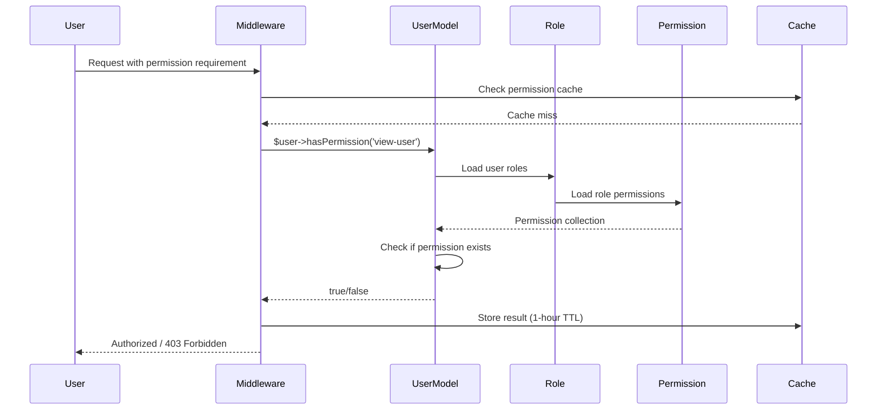

# RBAC & Permissions System

> **Role-Based Access Control with priority hierarchy and dynamic permissions** 

## 🔗 Table of Contents

- [Overview](#overview)
- [Role Priority System](#role-priority-system)
- [Permission Structure](#permission-structure)
- [Authorization Flow](#authorization-flow)
- [Dynamic Sidebar & Menus](#dynamic-sidebar--menus)
- [Database Schema](#database-schema)
- [Code Examples](#code-examples)
- [Best Practices](#best-practices)
- [Troubleshooting](#troubleshooting)
- [Cross-Links](#cross-links)

## Overview

The platform implements a sophisticated **priority-based RBAC system** where:
- Users can have multiple roles
- Roles have numeric priority (1 = highest)
- UI renders based on highest-priority role
- Permissions are tenant-scoped
- Menus and widgets are permission-controlled

### Key Concepts

**Role**: A named collection of permissions (e.g., "Tenant Admin", "Provider")

**Permission**: A specific capability (e.g., "view-user", "create-booking")

**Priority**: Numeric value determining which role takes precedence for UI rendering

**Policy**: Complex authorization rules beyond simple permissions

## Role Priority System

### How Priority Works

```php
User: John Doe
Roles:
  - Super Admin (priority: 1)      ← Highest priority
  - Tenant Admin (priority: 10)
  - Provider (priority: 50)
```

**Dashboard rendering:**
```php
$role = $user->getHighestPriorityRole(); // Returns "Super Admin"

return match ($role->name) {
    'Super Admin' => $this->getSuperAdminDashboard($user),
    'Tenant Admin' => $this->getAdminDashboard($user),
    // Other roles never reached for this user
};
```

### Priority Values

Configured in [`database/seeders/RoleSeeder.php`](file:///C:/Users/Victo/Downloads/backends/Bk-upflame/database/seeders/RoleSeeder.php):

| Role | Priority | Scope | Description |
|------|----------|-------|-------------|
| **Super Admin** | 1 | Platform | Full system access |
| **Tenant Admin** | 10 | Tenant | Tenant management |
| **Manager** | 30 | Tenant | Team management |
| **Provider** | 50 | Tenant | Service provider |
| **Ops** | 40 | Tenant | Operations staff |
| **Vendor** | 60 | Tenant | External vendor |
| **Customer** | 100 | Tenant | End user (lowest priority) |

**Lower number = higher priority**

### Implementation

**Model:** [`app/Domains/Access/Models/Role.php`](file:///C:/Users/Victo/Downloads/backends/Bk-upflame/app/Domains/Access/Models/Role.php)

```php
class Role extends Model
{
    use HasUuids, TenantScoped;
    
    protected $fillable = [
        tenant_id',
        'name',
        'description',
        'role_family',
        'priority',       // ← Priority column
        'is_system',
    ];
    
    public function users()
    {
        return $this->belongsToMany(User::class, 'user_roles')
            ->withPivot('tenant_id', 'assigned_by')
            ->withTimestamps();
    }
    
    public function permissions()
    {
        return $this->belongsToMany(Permission::class, 'role_permissions')
            ->withTimestamps();
    }
}
```

**User method:**
```php
// app/Domains/Identity/Models/User.php
public function getHighestPriorityRole()
{
    if (!$this->relationLoaded('roles')) {
        $this->load('roles');
    }
    
    return $this->roles->sortBy('priority')->first();
}
```

## Permission Structure

### Naming Convention

Format: `{action}-{resource}`

**Examples:**
- `view-user`, `create-user`, `update-user`, `delete-user`
- `view-booking`, `create-booking`, `cancel-booking`
- `view-workflow`, `execute-workflow`

### Permission Model

[`app/Domains/Access/Models/Permission.php`](file:///C:/Users/Victo/Downloads/backends/Bk-upflame/app/Domains/Access/Models/Permission.php):

```php
class Permission extends Model
{
    use HasUuids, TenantScoped;
    
    protected $fillable = [
        'tenant_id',
        'name',          // e.g., "view-user"
        'resource',      // e.g., "user"
        'action',        // e.g., "view"
        'description',
        'meta',          // JSON for extra data (widget visibility, etc.)
    ];
    
    protected $casts = [
        'meta' => 'array',
    ];
}
```

### Permission Categories

Defined in [`config/rbac.php`](file:///C:/Users/Victo/Downloads/backends/Bk-upflame/config/rbac.php):

**Resources:**
- `tenant` - Tenant management
- `user` - User management
- `role` - Role management
- `permission` - Permission management
- `provider` - Provider management
- `booking` - Booking management
- `workflow` - Workflow management
- `notification` - Notification management

**Actions:**
- `view / read`
- `create / write`
- `update`
- `delete`
- `execute` - Special actions (e.g., execute workflow)
- `manage` - Full control

## Authorization Flow

### Permission Check Flow



### hasPermission() Implementation

[`app/Domains/Identity/Models/User.php`](file:///C:/Users/Victo/Downloads/backends/Bk-upflame/app/Domains/Identity/Models/User.php#L100-L108):

```php
public function hasPermission(string $permission): bool
{
    foreach ($this->roles as $role) {
        if ($role->permissions->contains('name', $permission)) {
            return true;
        }
    }
    return false;
}
```

**With caching:**
```php
public function hasPermission(string $permission): bool
{
    $cacheKey = "user_{$this->id}_permission_{$permission}";
    
    return Cache::remember($cacheKey, 3600, function () use ($permission) {
        foreach ($this->roles as $role) {
            if ($role->permissions->contains('name', $permission)) {
                return true;
            }
        }
        return false;
    });
}
```

### Middleware Usage

**CheckPermission middleware:**  
[`app/Http/Middleware/CheckPermission.php`](file:///C:/Users/Victo/Downloads/backends/Bk-upflame/app/Http/Middleware/CheckPermission.php):

```php
class CheckPermission
{
    public function handle(Request $request, Closure $next, string $permission): Response
    {
        if (!$request->user() || !$request->user()->hasPermission($permission)) {
            if ($request->expectsJson()) {
                return response()->json(['message' => 'Forbidden'], 403);
            }
            abort(403, 'Unauthorized action.');
        }
        
        return $next($request);
    }
}
```

**Route usage:**
```php
Route::middleware(['auth', 'permission:view-user'])
    ->get('/users', [UserController::class, 'index']);
```

### Policy-Based Authorization

For complex rules, use policies:

```php
// app/Policies/BookingPolicy.php
class BookingPolicy
{
    public function cancel(User $user, Booking $booking): bool
    {
        // Providers can only cancel their own bookings
        if ($user->hasRole('Provider')) {
            return $booking->provider_id === $user->provider->id;
        }
        
        // Admins can cancel any booking
        if ($user->hasRole('Tenant Admin')) {
            return true;
        }
        
        return false;
    }
}
```

## Dynamic Sidebar & Menus

### Menu Database Structure

**menus table:**  
[`database/migrations/*_create_menus_table.php`](file:///C:/Users/Victo/Downloads/backends/Bk-upflame/database/migrations)

| Column | Type | Description |
|--------|------|-------------|
| id | ULID | Primary key |
| parent_id | ULID | For nested menus |
| label | string | Display text |
| route | string | Laravel route name |
| icon | string | Icon class (e.g., "fa-users") |
| group | string | Menu group (e.g., "Management") |
| group_order | int | Group display order |
| sort_order | int | Item order within group |
| scope | enum | 'platform', 'tenant', 'both' |
| required_permissions | json | Array of permission names |
| is_active | boolean | Enable/disable |
| meta | json | Additional data |

### Menu Model

[`app/Domains/Access/Models/Menu.php`](file:///C:/Users/Victo/Downloads/backends/Bk-upflame/app/Domains/Access/Models/Menu.php):

```php
class Menu extends Model
{
    protected $casts = [
        'required_permissions' => 'array',
        'meta' => 'array',
    ];
    
    public function scopeForUser($query, $user)
    {
        $query->where(function ($q) use ($user) {
            $q->where('scope', 'both');
            
            if ($user->isSuperAdmin()) {
                $q->orWhere('scope', 'platform');
            } else {
                $q->orWhere('scope', 'tenant');
            }
        });
        
        return $query;
    }
    
    public function isAccessibleBy($user): bool
    {
        if (empty($this->required_permissions)) {
            return true; // No permission required
        }
        
        // User needs ANY of the required permissions
        foreach ($this->required_permissions as $permission) {
            if ($user->hasPermission($permission)) {
                return true;
            }
        }
        
        return false;
    }
}
```

### Sidebar Service

[`app/Services/SidebarService.php`](file:///C:/Users/Victo/Downloads/backends/Bk-upflame/app/Services/SidebarService.php):

```php
class SidebarService
{
    public function buildForUser(User $user): array
    {
        $cacheKey = "sidebar_menu_{$user->id}";
        
        return Cache::remember($cacheKey, 600, function () use ($user) {
            return $this->buildMenuStructure($user);
        });
    }
    
    protected function buildMenuStructure(User $user): array
    {
        $menus = Menu::active()
            ->forUser($user)
            ->orderBy('group_order')
            ->orderBy('sort_order')
            ->get();
        
        // Filter by permissions
        $accessibleMenus = $menus->filter(
            fn($menu) => $menu->isAccessibleBy($user)
        );
        
        // Group by menu group
        return $accessibleMenus->groupBy('group')->map(function ($items) {
            return [
                'group' => $items->first()->group,
                'items' => $items->map(fn($menu) => [
                    'label' => $menu->label,
                    'url' => route($menu->route),
                    'icon' => $menu->icon,
                    'active' => request()->routeIs($menu->route),
                ])
            ];
        })->values()->toArray();
    }
}
```

### Blade Rendering

```blade
<!-- resources/views/layouts/sidebar.blade.php -->
@foreach ($sidebar as $group)
    <div class="menu-group">
        <h3>{{ $group['group'] }}</h3>
        <ul>
            @foreach ($group['items'] as $item)
                <li class="{{ $item['active'] ? 'active' : '' }}">
                    <a href="{{ $item['url'] }}">
                        <i class="{{ $item['icon'] }}"></i>
                        {{ $item['label'] }}
                    </a>
                </li>
            @endforeach
        </ul>
    </div>
@endforeach
```

## Database Schema

### roles table

```sql
CREATE TABLE `roles` (
    `id` char(26) PRIMARY KEY,  -- ULID
    `tenant_id` char(26) NULL,
    `name` varchar(255) NOT NULL,
    `description` text NULL,
    `role_family` varchar(100) NULL,
    `priority` int NOT NULL DEFAULT 100,
    `is_system` boolean NOT NULL DEFAULT false,
    `created_at` timestamp NULL,
    `updated_at` timestamp NULL,
    
    KEY `idx_tenant_priority` (`tenant_id`, `priority`)
);
```

### permissions table

```sql
CREATE TABLE `permissions` (
    `id` char(26) PRIMARY KEY,
    `tenant_id` char(26) NULL,
    `name` varchar(255) NOT NULL,      -- e.g., "view-user"
    `resource` varchar(100) NULL,       -- e.g., "user"
    `action` varchar(100) NULL,         -- e.g., "view"
    `description` text NULL,
    `meta` json NULL,
    `created_at` timestamp NULL,
    `updated_at` timestamp NULL,
    
    UNIQUE KEY `unique_tenant_permission` (`tenant_id`, `name`)
);
```

### role_permissions table (pivot)

```sql
CREATE TABLE `role_permissions` (
    `role_id` char(26) NOT NULL,
    `permission_id` char(26) NOT NULL,
    `created_at` timestamp NULL,
    `updated_at` timestamp NULL,
    
    PRIMARY KEY (`role_id`, `permission_id`),
    FOREIGN KEY (`role_id`) REFERENCES `roles`(`id`) ON DELETE CASCADE,
    FOREIGN KEY (`permission_id`) REFERENCES `permissions`(`id`) ON DELETE CASCADE
);
```

### user_roles table (pivot)

```sql
CREATE TABLE `user_roles` (
    `user_id` char(26) NOT NULL,
    `role_id` char(26) NOT NULL,
    `tenant_id` char(26) NOT NULL,
    `assigned_by` char(26) NULL,
    `created_at` timestamp NULL,
    `updated_at` timestamp NULL,
    
    PRIMARY KEY (`user_id`, `role_id`, `tenant_id`),
    FOREIGN KEY (`user_id`) REFERENCES `users`(`id`) ON DELETE CASCADE,
    FOREIGN KEY (`role_id`) REFERENCES `roles`(`id`) ON DELETE CASCADE,
    FOREIGN KEY (`tenant_id`) REFERENCES `tenants`(`id`) ON DELETE CASCADE
);
```

## Code Examples

### Assigning Roles

```php
// Assign role to user
$user->roles()->attach($roleId, [
    'tenant_id' => $tenantId,
    'assigned_by' => auth()->id(),
]);

// Remove role
$user->roles()->detach($roleId);

// Sync roles (replace all)
$user->roles()->sync([$adminRoleId, $providerRoleId]);
```

### Creating Custom Permissions

```php
$permission = Permission::create([
    'tenant_id' => $tenantId,
    'name' => 'export-reports',
    'resource' => 'reports',
    'action' => 'export',
    'description' => 'Can export reports to PDF/Excel',
]);

// Attach to role
$role->permissions()->attach($permission->id);
```

### Checking Permissions in Controllers

```php
public function destroy(User $user)
{
    if (!auth()->user()->hasPermission('delete-user')) {
        abort(403, 'You do not have permission to delete users');
    }
    
    $user->delete();
    return redirect()->back()->with('success', 'User deleted');
}
```

### Checking Permissions in Blade

```blade
@if (auth()->user()->hasPermission('create-user'))
    <a href="{{ route('users.create') }}" class="btn">
        Create User
    </a>
@endif
```

## Best Practices

### ✅ DO

1. **Use permission-based checks**, not role-based:
   ```php
   // ✅ Good
   if ($user->hasPermission('delete-booking')) { ... }
   
   // ❌ Bad
   if ($user->hasRole('Admin')) { ... }
   ```

2. **Cache permission checks** for performance
3. **Use middleware** for route protection
4. **Document custom permissions** in seeders
5. **Test with multiple roles** to ensure priority works

### ❌ DON'T

1. **Don't hardcode role names** in business logic
2. **Don't forget tenant_id** in role/permission queries
3. **Don't grant overly broad permissions**
4. **Don't skip cache invalidation** when updating permissions

## Troubleshooting

### Issue: User Has Permission But Still Gets 403

**Diagnosis:**
```php
$user = auth()->user();
dd([
    'has_permission' => $user->hasPermission('view-user'),
    'roles' => $user->roles->pluck('name'),
    'permissions' => $user->roles->flatMap->permissions->pluck('name')
]);
```

**Common causes:**
- Permission name mismatch (e.g., "view-user" vs "view-users")
- Cache not cleared after permission update
- Missing permission in role

**Solution:**
```php
// Clear user permission cache
Cache::forget("user_{$user->id}_permission_view-user");

// Or clear all permission caches
Cache::tags(['permissions'])->flush();
```

### Issue: Sidebar Not Showing Menu Items

**Diagnosis:**
```php
$user = auth()->user();
$menus = Menu::active()->forUser($user)->get();

foreach ($menus as $menu) {
    dump([
        'label' => $menu->label,
        'required_permissions' => $menu->required_permissions,
        'accessible' => $menu->isAccessibleBy($user),
    ]);
}
```

**Solution:** Ensure user has at least ONE of the required permissions.

## Cross-Links

- [Authentication](authentication.md) - How users log in
- [Dashboard](sidebar-and-dashboard.md) - Dashboard rendering based on roles
- [Database Schema](database-schema.md) - Complete DB structure
- [Seeders](database-schema.md#seeders) - Default roles and permissions
