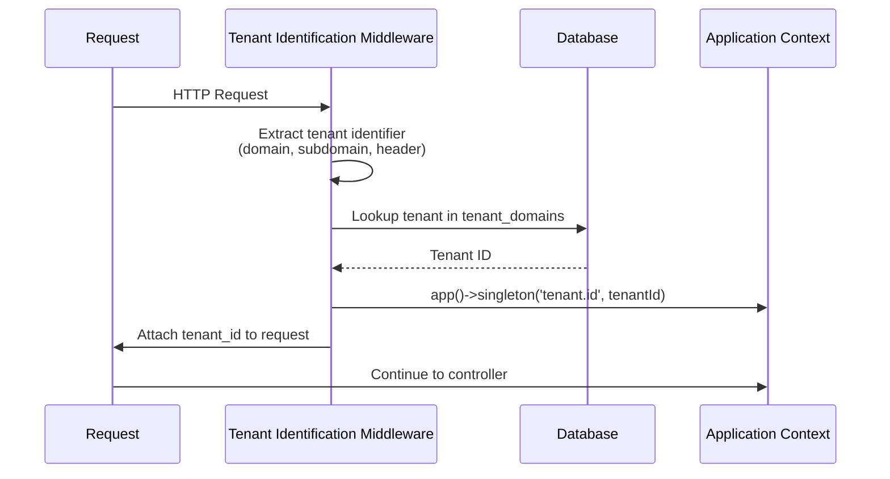

# Multi-Tenancy

> **Complete tenant isolation and management architecture**

## 🔗 Table of Contents

- [Overview](#overview)
- [Tenant Identification](#tenant-identification)
- [Data Isolation](#data-isolation)
- [Tenant Lifecycle](#tenant-lifecycle)
- [Subscription Tiers](#subscription-tiers)
- [Multi-Domain Support](#multi-domain-support)
- [Tenant Context Propagation](#tenant-context-propagation)
- [Best Practices](#best-practices)
- [Troubleshooting](#troubleshooting)
- [Cross-Links](#cross-links)

## Overview

The platform implements **true multi-tenancy** where each organization (tenant) operates in complete isolation with their own:
- Users and roles
- Data (bookings, providers, workflows)
- Configuration and settings
- Custom domains
- Feature flags

### What is a Tenant?

A tenant represents an **independent organization** using the platform. Examples:
- Hospital A
- Clinic Network B
- Professional Services Firm C

Each tenant is completely isolated from others—they cannot see or access each other's data.

## Tenant Identification

### Identification Strategies

The platform supports multiple strategies configured via `config/tenant.php`:

#### 1. Domain-Based (Default)
```env
TENANT_IDENTIFICATION_STRATEGY=domain
```

**How it works:**
```
hospitala.example.com → Tenant: Hospital A
clinicb.example.com   → Tenant: Clinic B
```

**Implementation:**  
[`app/Http/Middleware/TenantIdentification.php`](file:///C:/Users/Victo/Downloads/backends/Bk-upflame/app/Http/Middleware/TenantIdentification.php)

```php
protected function identifyByDomain(Request $request)
{
    $host = $request->getHost();
    
    $domain = TenantDomain::where('domain', $host)
        ->where('verified', true)
        ->first();
    
    return $domain?->tenant_id;
}
```

#### 2. Subdomain-Based
```env
TENANT_IDENTIFICATION_STRATEGY=subdomain
```

**Example:**
```
hospitala.platform.com → Tenant: hospitala
clinicb.platform.com   → Tenant: clinicb
```

#### 3. Header-Based (API)
```env
TENANT_IDENTIFICATION_STRATEGY=header
```

**Example:**
```http
GET /api/bookings
X-Tenant-ID: 01HXYZ1234ABCDEFGHJ56789
```

**Use case:** Mobile apps, server-to-server APIs

#### 4. Parameter-Based
```env
TENANT_IDENTIFICATION_STRATEGY=parameter
```

**Example:**
```
GET /dashboard?tenant_id=01HXYZ...
```

⚠️ **Security Warning:** parameter-based identification is less secure and not recommended for production.

### Tenant Resolution Flow



## Data Isolation

### Global Scope Enforcement

All tenant-scoped models use the `TenantScoped` trait:

**`app/Support/Domain/Shared/Traits/TenantScoped.php`:**
```php
trait TenantScoped
{
    protected static function booted(): void
    {
        static::addGlobalScope('tenant', function ($query) {
            if ($tenantId = app('tenant.id')) {
                $query->where('tenant_id', $tenantId);
            }
        });
        
        static::creating(function ($model) {
            if (!$model->tenant_id) {
                $model->tenant_id = app('tenant.id');
            }
        });
    }
}
```

**Models using this trait:**
- `Role`
- `Permission`
- `Booking`
- `Provider`
- `Workflow`
- `UserSession`
- `DashboardWidget`

### How It Works

```php
// Without global scope (dangerous)
User::all(); // Returns ALL users across ALL tenants

// With TenantScoped trait (automatic)
app()->singleton('tenant.id', fn() => 'tenant-123');
User::all(); // Returns only users for tenant-123
```

**Bypass when needed:**
```php
User::withoutGlobalScope('tenant')->get(); // All tenants
```

⚠️ **Security:** Only use `withoutGlobalScope` in Super Admin contexts!

### Database Schema

**tenants table:**
| Column | Type | Description |
|--------|------|-------------|
| id | ULID | Primary key |
| name | string | Display name |
| slug | string | URL-safe identifier |
| domain | string | Primary domain |
| status | enum | active, suspended, deleted |
| tier | enum | free, basic, premium, enterprise |
| config_json | json | Tenant-specific configuration |

**tenant_domains table (multi-domain support):**
| Column | Type | Description |
|--------|------|-------------|
| id | ULID | Primary key |
| tenant_id | ULID | Foreign key to tenants |
| domain | string | Custom domain (e.g., clinic.com) |
| verified | boolean | DNS verification status |

## Tenant Lifecycle

### 1. Creation

```php
use App\Domains\Identity\Models\Tenant;

$tenant = Tenant::create([
    'name' => 'Hospital A',
    'tier' => 'premium',
    'timezone' => 'America/New_York',
    'locale' => 'en-US',
]);

// Slug auto-generated: 'hospital-a'
```

**Automatically created:**
- Default roles (Tenant Admin, Manager, User)
- Default permissions
- Tenant configuration record

### 2. Activation

```php
$tenant->update(['status' => 'active']);

// Enable modules
$tenant->modules()->create([
    'module_name' => 'bookings',
    'enabled' => true,
]);
```

### 3. Suspension

```php
$tenant->update(['status' => 'suspended']);

// Effect: All users blocked from login
// Data preserved for reactivation
```

### 4. Deletion (Soft)

```php
$tenant->update(['status' => 'deleted']);

// Mark for deletion
// Actual data deletion via scheduled command after grace period
```

## Subscription Tiers

Configured in [`config/tenant.php`](file:///C:/Users/Victo/Downloads/backends/Bk-upflame/config/tenant.php):

### Free Tier
- 5 users
- 3 providers
- 100 bookings/month
- 2 workflows

### Basic Tier
- 25 users
- 10 providers
- 500 bookings/month
- 5 workflows

### Premium Tier
- 100 users
- 50 providers
- 5,000 bookings/month
- 20 workflows

### Enterprise Tier
- 1,000 users
- 200 providers
- 50,000 bookings/month
- 100 workflows
- Custom integrations
- Dedicated support

### Enforcement

```php
class EnforceTenantLimits
{
    public function handle(Request $request, Closure $next)
    {
        $tenant = Tenant::find(app('tenant.id'));
        $limits = config("tenant.subscription_tiers.{$tenant->tier}.limits");
        
        $currentUsers = $tenant->users()->count();
        
        if ($currentUsers >= $limits['users']) {
            throw new TenantLimitExceededException('User limit reached');
        }
        
        return $next($request);
    }
}
```

## Multi-Domain Support

### Adding Custom Domain

```php
$tenant->domains()->create([
    'domain' => 'booking.hospitalnetwor.com',
    'verified' => false,
]);

// Verification process:
// 1. Generate verification token
// 2. User adds DNS TXT record
// 3. System verifies DNS
// 4. Mark verified = true
``

### DNS Verification

```bash
# User adds DNS record:
TXT _tenant_verify.booking.hospitalnetwork.com = "verify_abc123def456"
```

```php
// Verification code
$dns = dns_get_record("_tenant_verify.{$domain}", DNS_TXT);
$verified = collect($dns)->contains(
    fn($record) => str_contains($record['txt'], $verificationToken)
);
```

## Tenant Context Propagation

### Web Requests

```mermaid
graph LR
    A[HTTP Request] --> B[TenantIdentification Middleware]
    B --> C[Set app('tenant.id')]
    C --> D[TenantScope Middleware]
    D --> E[Apply Global Scopes]
    E --> F[Controller]
```

### API Requests

```http
POST /api/v1/bookings
Authorization: Bearer <sanctum_token>
X-Tenant-ID: 01HXYZ...

# Token already associated with user
# User already associated with tenant
# X-Tenant-ID validated against user's tenant
```

### Console Commands

```php
Artisan::command('tenant:sync {tenant_id}', function ($tenantId) {
    app()->singleton('tenant.id', fn() => $tenantId);
    
    // Now all queries are scoped to this tenant
    $users = User::all();
});
```

### Queued Jobs

```php
class ProcessBooking implements ShouldQueue
{
    public function __construct(
        public string $bookingId,
        public string $tenantId
    ) {}
    
    public function handle()
    {
        app()->singleton('tenant.id', fn() => $this->tenantId);
        
        $booking = Booking::find($this->bookingId);
        // Process...
    }
}
```

## Best Practices

### ✅ DO

1. **Always use TenantScoped trait** for tenant-specific models
2. **Test with multiple tenants** to ensure isolation
3. **Validate tenant context** in middleware, not controllers
4. **Use tenant_id foreign keys** with proper indexes
5. **Cache with tenant-scoped keys**: `cache_key_{$tenant_id}`

### ❌ DON'T

1. **Don't bypass global scopes** unless absolutely necessary
2. **Don't store tenant_id in session** (user middleware identification)
3. **Don't forget tenant_id** in pivot tables
4. **Don't share cache across tenants**
5. **Don't use global singletons** without tenant scoping

## Troubleshooting

### Issue: User Sees Data from Wrong Tenant

**Diagnosis:**
```php
// Check current tenant context
dd(app('tenant.id'));

// Check user's tenant
dd(auth()->user()->tenant_id);
```

**Solution:** Ensure middleware stack includes `TenantIdentification` before controllers.

### Issue: Can't Create Records (Missing tenant_id)

**Diagnosis:**
```php
// Check if tenant context is set
if (!app()->bound('tenant.id')) {
    throw new Exception('Tenant context not set');
}
```

**Solution:** Model must use `TenantScoped` trait or manually set `tenant_id`.

### Issue: Global Scope Bypassed Unintentionally

**Diagnosis:** Search codebase for `withoutGlobalScope`

**Solution:** Refactor to use proper scoping or add explicit authorization checks.

## Cross-Links

- [Architecture](architecture.md) - Overall system design
- [Security](security.md) - Security considerations
- [Database Schema](database-schema.md) - Tenant table structures
- [Middleware](middleware.md) - TenantIdentification middleware
- [Configuration](config-and-env.md) - Tenant config options
