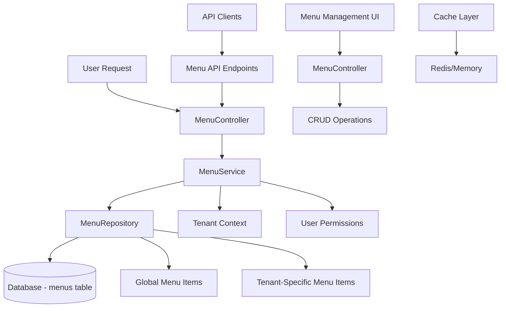

# Enterprise Dynamic Menu System Architecture

## Overview

This document describes the architecture of the enterprise-grade dynamic menu system that replaces the hard-coded menu approach with a flexible, database-driven solution.

## Architecture Diagram



## Components

### 1. Database Schema (`menus` table)

- `id` (UUID) - Primary key
- `tenant_id` (UUID, nullable) - Tenant-specific override
- `key` (string, unique) - Unique identifier
- `label` (string) - Display text
- `icon` (string, nullable) - Icon class
- `route` (string, nullable) - Laravel route name
- `url` (string, nullable) - External URL
- `permission` (string, nullable) - Required permission
- `order` (integer) - Display order
- `parent_id` (UUID, nullable) - Parent menu item
- `type` (enum) - link, heading, separator, module
- `is_enabled` (boolean) - Enable/disable flag
- `metadata` (JSON, nullable) - Additional data

### 2. Domain Structure

```
app/Domains/Menu/
├── Models/
│   └── Menu.php
├── Repositories/
│   └── MenuRepository.php
├── Services/
│   └── MenuService.php
├── Providers/
│   └── MenuServiceProvider.php
└── Database/
    ├── Migrations/
    │   └── 2025_11_24_174100_create_menus_table.php
    └── Factories/
```

### 3. Core Classes

#### Menu Model
- Extends Eloquent Model
- Uses UUIDs and tenant scoping
- Defines relationships (parent/children)
- Provides scopes for enabled items and types

#### MenuRepository
- Retrieves menu items with tenant and permission filtering
- Handles CRUD operations
- Applies business logic for menu item management

#### MenuService
- Coordinates menu retrieval for current user
- Integrates with tenant context and user permissions
- Provides high-level menu management operations

### 4. API Endpoints

- `GET /api/v1/menus` - Get current user's menu items
- `GET /api/v1/menus/all` - Get all menu items for tenant
- `POST /api/v1/menus` - Create new menu item
- `GET /api/v1/menus/{menu}` - Get specific menu item
- `PUT /api/v1/menus/{menu}` - Update menu item
- `DELETE /api/v1/menus/{menu}` - Delete menu item

### 5. Features

#### Tenant Awareness
- Global default menu items (tenant_id = null)
- Tenant-specific overrides
- Automatic tenant context resolution

#### Role & Permission Filtering
- Permission-based visibility
- Dynamic filtering based on user permissions
- Support for complex permission rules

#### Hierarchical Structure
- Parent-child relationships
- Unlimited nesting levels
- Ordered display

#### Caching (Future Enhancement)
- Per-user menu caching
- Cache invalidation on updates
- Performance optimization

#### Admin UI
- Menu management interface
- CRUD operations for menu items
- Real-time preview

## Benefits

1. **Dynamic & Configurable** - No code changes needed to modify menus
2. **Tenant-Aware** - Different menus per tenant
3. **Permission-Based** - Items shown based on user permissions
4. **Hierarchical** - Support for nested menu structures
5. **API-First** - Works with any frontend technology
6. **Extensible** - Easy to add new features
7. **Performance** - Caching capabilities
8. **Enterprise-Grade** - Matches Microsoft/Azure portal standards

## Implementation Status

- [x] Database migration
- [x] Menu model
- [x] Repository pattern
- [x] Service layer
- [x] API endpoints
- [x] Menu management UI
- [x] Integration with existing controllers
- [x] Blade template updates
- [ ] Caching implementation
- [ ] Feature flags integration